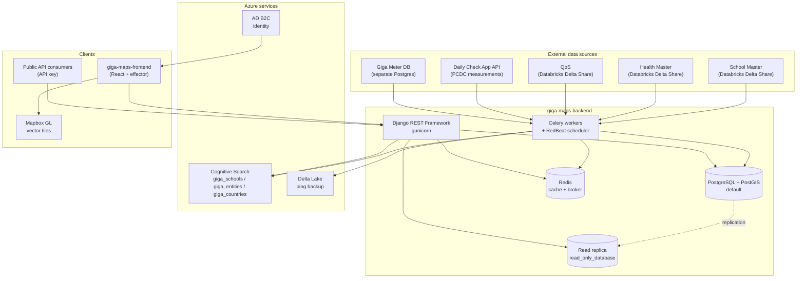
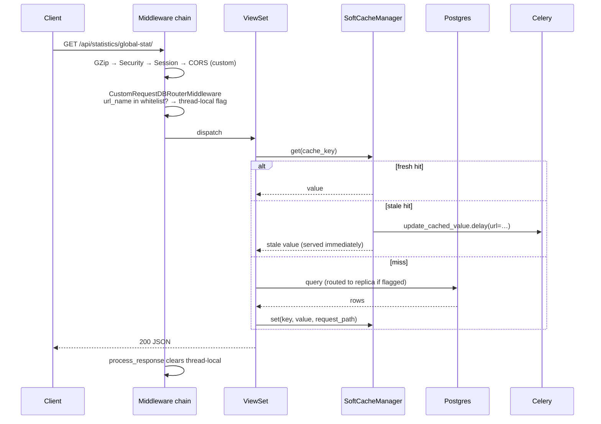

# Architecture

## What GigaMaps is

GigaMaps is an open, live global map of school connectivity, built by UNICEF/ITU's **Giga**
initiative. It answers three questions for every school on Earth:

1. **Where is it?** — location data from ~50 government bodies, OpenStreetMap, and Giga's AI model.
2. **Is it connected, right now?** — real-time connectivity measured by the Giga Meter desktop app
   and Chrome extension, Brazil's nic.br app, and ISP partnerships.
3. **What infrastructure is near it?** — coverage and infrastructure data from ITU, Meta, GSMA and
   government partners.

This repository is the **backend**: a Django application that ingests those data sources,
aggregates them, serves them to the public map and the public API, and provides an admin console
for data stewardship.

## The big picture



## Components

### Web tier

`gunicorn config.wsgi:application` with 8 workers and a 300s timeout, started by
[web-worker.sh:15](../../web-worker.sh#L15). It runs `migrate` and `collectstatic` on boot, so a
deploy is also a migration. A small Flask app ([hello.py](../../hello.py)) is started alongside on
port 8000 in the worker/beat containers purely as a health/SSH sidecar.

Routing is flat and namespaced by app — see [config/urls.py:32](../../config/urls.py#L32):

| Prefix | App |
|---|---|
| `/api/auth/` | `custom_auth` — users, roles |
| `/api/locations/` | `locations` (countries) **and** `schools` (schools, tiles, downloads) |
| `/api/background/` | `background` — background task registry |
| `/api/statistics/` | `connection_statistics` |
| `/api/contact/` | `contact` |
| `/api/about_us/` | `about_us` |
| `/api/accounts/` | `accounts` — API keys, data layers, advanced filters, app config |
| `/api/sources/` | `data_sources` — school master review/publish, manual loads |
| `/api/v2/entities/` | `entities` — the generic Entity subsystem |
| `/health/` | liveness probe returning `OK` |

Note that **two apps share the `/api/locations/` prefix**. `locations.api_urls` is included first,
so its patterns win on collision.

### Worker tier

Celery with Redis as broker. Three moving parts:

- **Workers** — [celery.sh](../../celery.sh), concurrency 3. Note the CLI passes
  `--time-limit=300 --soft-time-limit=60`, but nearly every task overrides these with its own
  much longer `@app.task(soft_time_limit=…, time_limit=…)` decorator (up to 10 hours).
- **Beat** — [celerybeat.sh](../../celerybeat.sh) using `redbeat.RedBeatScheduler`, so the schedule
  lives in Redis under the key prefix `gigamaps:` rather than in the database.
- **Flower** — optionally started in the same container when `ENABLED_FLOWER_METRICS` is true.

Broker settings that matter, from [proco/taskapp/__init__.py:16](../../proco/taskapp/__init__.py#L16):

```python
app.conf.broker_transport_options = {"visibility_timeout": 36000}  # 10h
app.conf.worker_deduplicate_successful_tasks = True
app.conf.redbeat_lock_timeout = 36000
```

The 10-hour visibility timeout exists because the longest tasks (`update_entity_records`,
`redo_aggregations_task`) declare 10-hour limits. Without it, Redis would redeliver a
still-running task to a second worker.

### Data tier

Three database connections, selected by a chain of routers declared in
[config/settings/base.py:473](../../config/settings/base.py#L473):

```python
DATABASE_ROUTERS = [
    'proco.utils.db_routers.ReadOnlyDBRouter',
    'proco.giga_meter.db_router.GigaMeterDBRouter',
    'dynamic_db_router.DynamicDbRouter',
]
```

| Alias | Purpose |
|---|---|
| `default` | Primary PostgreSQL + PostGIS. All writes. |
| `read_only_database` | Read replica. Used for a **whitelist** of heavy GET endpoints. |
| `gigameter_database` | Separate Giga Meter Postgres, read by the `giga_meter` app's models. |

Replica routing is request-scoped, not model-scoped: `CustomRequestDBRouterMiddleware` resolves the
URL name of each GET request and, if it appears in `READ_ONLY_DATABASE_ALLOWED_REQUESTS`, sets a
thread-local flag that `ReadOnlyDBRouter` reads. See
[02-domain-model/databases-and-routing.md](../02-domain-model/databases-and-routing.md) for the
full mechanism and its thread-local caveats.

### Cache tier

Redis, via `django_redis`, with a **24-hour default timeout** and a custom soft-expiry layer
(`SoftCacheManager`) on top. The distinguishing behaviour: a stale entry is still *served* while a
Celery task is dispatched to refresh it, so users never wait on a cold rebuild. Covered in
[08-operations/caching-and-performance.md](../08-operations/caching-and-performance.md).

### Search tier

Azure Cognitive Search, three indexes:

| Index | Env var | Default | Built by |
|---|---|---|---|
| Countries | `COUNTRY_INDEX_NAME` | `giga_countries` | — |
| Schools | `SCHOOL_INDEX_NAME` | `giga_schools` | `rebuild_school_index` *(now disabled)* |
| Entities | `ENTITIES_INDEX_NAME` | `giga_entities` | `rebuild_unified_index` |

## The school / entity duality

The single most important thing to understand about this codebase: **there are two parallel
modelling systems for the same kind of thing.**

- The original **`School`** model ([proco/schools/models.py:18](../../proco/schools/models.py#L18))
  with its own statistics tables, ingestion jobs, cache warmer and search index.
- A newer, generic **`Entity`** / **`EntityType`** system
  ([proco/entities/models.py](../../proco/entities/models.py)) designed so that health facilities,
  libraries and other point-of-interest types can reuse the same machinery — with `school` itself
  registered as a legacy entity type via the `is_legacy` flag.

Both are live. The beat schedule runs **both** job families side by side, and
[proco/taskapp/__init__.py:26](../../proco/taskapp/__init__.py#L26) carries explicit markers:

```python
# TODO: Comment out once entity code is deployed with new FE
# 1. Old Cache Warmup (replaced by update_all_entity_cached_values)
```

The two legacy jobs named there are already commented out; the rest of the school-side jobs are
not. Read [02-domain-model/entities.md](../02-domain-model/entities.md) before changing anything
in this area.

## Request lifecycle



The middleware order is defined at
[config/settings/base.py:90](../../config/settings/base.py#L90). Two entries are project-specific:

- `proco.utils.middleware.CustomCorsMiddleware` — replaces `corsheaders`, which is installed but
  commented out.
- `proco.utils.db_routers.CustomRequestDBRouterMiddleware` — the replica selector, and it must be
  **last** so that the thread-local is set after authentication but before the view runs.

## Authentication

Two mechanisms coexist:

1. **JWT via Azure AD B2C** for the frontend and admin console. `RS256`, `Bearer` prefix, 1-day
   expiry, verified against a public key —
   [config/settings/base.py:388](../../config/settings/base.py#L388). The DRF default auth class is
   `proco.custom_auth.authentication.JSONWebTokenAuthentication`.
2. **API keys** for public API consumers, gated per-API and per-country with an approval workflow.
   See [03-user-flows/api-key-request.md](../03-user-flows/api-key-request.md) and
   [04-admin-flows/api-key-approval.md](../04-admin-flows/api-key-approval.md).

Authorization is a custom role/permission system (**47 permission slugs**), not Django's built-in
`auth.Permission`. See [04-admin-flows/auth-and-rbac.md](../04-admin-flows/auth-and-rbac.md).

## Observability

| Concern | Mechanism |
|---|---|
| Metrics | `django_prometheus`, mounted at `/` when `ENABLED_BACKEND_PROMETHEUS_METRICS` |
| Task monitoring | Flower, when `ENABLED_FLOWER_METRICS` |
| Errors | Sentry — `/sentry-debug/` deliberately raises `ZeroDivisionError` to test wiring |
| In-app job tracking | The `BackgroundTask` model — every long task registers itself |
| Data-change alerts | Slack webhook, `SCHOOL_MASTER_DATA_CHANGES_SLACK_WEBHOOK_URL` |
| Logs | Named logger hierarchy under `gigamaps.*`, level from `GIGAMAPS_LOG_LEVEL` |

## Related documents

- [tech-stack.md](tech-stack.md) — versions and libraries
- [repo-map.md](repo-map.md) — what lives in which directory
- [glossary.md](glossary.md) — domain vocabulary
- [../02-domain-model/data-model.md](../02-domain-model/data-model.md) — the ERD
