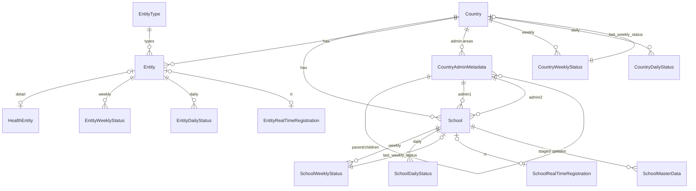

# Data model

The entity-relationship picture, and the conventions that apply to almost every model.

---

## Core entities



## `Country`

[proco/locations/models.py:32](../../proco/locations/models.py#L32). `GeometryMixin` +
`TimeStampedModel`.

| Field | Note |
|---|---|
| `name`, `code`, `iso3_format` | `code` is the short code used in URLs; `iso3_format` matches Delta Share table names |
| `flag`, `map_preview` | Images |
| `description`, `data_source`, `data_source_description`, `health_data_source` | Attribution shown in the UI. Note the **separate** `health_data_source` for entities |
| `date_of_join`, `date_schools_mapped` | Onboarding milestones |
| `benchmark_metadata` | JSON — per-country connectivity thresholds |
| `country_disclaimer` | Shown on disputed/sensitive territories |
| `last_weekly_status` | Denormalised FK, `SET_NULL` |
| `deleted` | Soft delete |

> **`code` has no unique constraint.** `Country.Meta` declares only `ordering`. Lookups by
> `code.lower()` — which the cache warmer does with `reverse('locations:countries-detail',
> kwargs={'pk': country.code.lower()})` — assume uniqueness that the schema does not enforce.

## `CountryAdminMetadata`

[proco/locations/models.py:152](../../proco/locations/models.py#L152). A **self-referencing tree** of
administrative areas.

| Field | Note |
|---|---|
| `layer_name` | `adm0` (country), `adm1` (state), `adm2` (city) |
| `name`, `name_en` | Local and English names |
| `description_ui_label` | Defaults to `'Admins'` — what the UI calls this level |
| `giga_id_admin` | Giga's identifier; the join key from master data |
| `mapbox_id` | Mapbox boundary identifier |
| `parent` | Self-FK, `SET_NULL` |
| bbox fields | From `BBoxMixin` |

The constants are `adm0`/`adm1`/`adm2`, while the management command flags are `admin0`/`admin1`/
`admin2` and the `School` FKs are `admin1`/`admin2`. Three spellings of the same idea — worth
knowing when grepping.

## `School`

[proco/schools/models.py:18](../../proco/schools/models.py#L18).

| Group | Fields |
|---|---|
| Identity | `giga_id_school`, `external_id` (government id, lower-cased on save), `name`, `name_lower` |
| Geography | `country`, `admin1`, `admin2`, `geopoint`, `timezone`, `gps_confidence`, `altitude`, `address`, `postal_code` |
| Classification | `education_level`, `education_level_govt`, `education_level_regional`, `environment` (`rural`/`urban`), `school_type`, `is_verified_school` |
| Denormalised status | `connectivity_status`, `coverage_status`, `coverage_type` — all default `'unknown'` |
| Link | `last_weekly_status` |
| Lifecycle | `establishment_year`, `deleted` |

### Lower-cased shadow columns

`name_lower`, `education_level_lower`, `education_level_govt_lower`, `school_type_lower` are
`editable=False`, `db_index=True`, and maintained in `save()`:

```python
def save(self, **kwargs):
    self.name_lower = str(self.name).lower()
    ...
    self.external_id = str(self.external_id).lower()
    super().save(**kwargs)
```

They exist so case-insensitive search can use a plain B-tree index instead of a functional one.

> **`bulk_update` and `update()` bypass `save()`**, so any code path using them must set the
> `*_lower` columns itself. `data_cleanup --populate_school_lowercase_fields` exists to repair the
> drift, which suggests it has happened.
>
> Note also `education_level_regional = models.CharField(max_length=6400007)` — almost certainly a
> typo for a smaller bound. PostgreSQL ignores the length for storage purposes, so it is harmless in
> practice, but it will confuse anyone reading the schema.

### Soft delete cascades

```python
def delete(self, *args, **kwargs):
    force = kwargs.pop('force', False)
    if force:
        super().delete(*args, **kwargs)
    else:
        self.deleted = timezone.now()
        self.save()
    self.daily_status.all().update(deleted=timezone.now())
    self.weekly_status.all().update(deleted=timezone.now())
```

Two things to note: `force=True` performs a real delete, and the status cascade runs in **both**
branches — so a hard-deleted school still soft-deletes its statistics, leaving orphaned rows.

## Statistics models

[proco/connection_statistics/models.py](../../proco/connection_statistics/models.py). All inherit
the abstract `ConnectivityStatistics`, which holds the measurement fields:

| Group | Fields |
|---|---|
| Speed | `connectivity_speed`, `connectivity_upload_speed`, `*_probe`, `*_mean` (bps) |
| Latency | `connectivity_latency`, `connectivity_latency_probe`, `roundtrip_time` (ms) |
| Quality | `jitter_download`, `jitter_upload`, `rtt_packet_loss_pct`, `uptime` |
| Derived | `is_connected_true`, `is_connected_all` |
| Provenance | `live_data_source` |

| Model | Grain |
|---|---|
| `CountryWeeklyStatus` | country × ISO (year, week) |
| `CountryDailyStatus` | country × date |
| `SchoolWeeklyStatus` | school × ISO (year, week) |
| `SchoolDailyStatus` | school × date |
| `EntityWeeklyStatus` | entity × ISO (year, week) |
| `EntityDailyStatus` | entity × date |
| `RealTimeConnectivity` | raw measurement |
| `EntityRealTimeConnectivity` | raw measurement |
| `SchoolRealTimeRegistration` | one per school |
| `EntityRealTimeRegistration` | one per entity |

> **`CountryWeeklyStatus` and `CountryDailyStatus` are shared between the school and entity
> pipelines.** There is no entity-specific country rollup. See
> [../05-background-jobs/aggregation.md](../05-background-jobs/aggregation.md).

`connectivity_speed` uses `PositiveBigIntegerField`, a project-specific field
([proco/core/models.py:14](../../proco/core/models.py#L14)) — bits per second exceeds a 32-bit
integer for fast links.

## Base mixins

[proco/core/models.py](../../proco/core/models.py):

| Mixin | Provides |
|---|---|
| `BaseModelMixin` | `created_at`, `last_modified_at`, `deleted`, soft-delete manager |
| `BaseModel` | `BaseModelMixin` + `created_by`, `last_modified_by` |
| `DataSourceModelMixin` | `pulled_at` |
| `MasterDataSourceModelMixin` | The eight-state review machine, `HistoricalRecords`, geography and infrastructure fields |
| `CustomDateTimeField` | Project datetime handling |
| `PositiveBigIntegerField` | 64-bit positive integer |

## Conventions

### Soft delete

`deleted` is a nullable timestamp. `BaseManager` filters `deleted__isnull=True`.

Unique constraints are declared **twice**:

```python
constraints = [
    UniqueConstraint(fields=['country', 'giga_id_school', 'deleted'],
                     name='schools_giga_id_unique_with_deleted'),
    UniqueConstraint(fields=['country', 'giga_id_school'],
                     condition=Q(deleted=None),
                     name='schools_giga_id_unique_without_deleted'),
]
```

The partial constraint enforces uniqueness among live rows; the full one allows multiple deleted
rows only if their `deleted` timestamps differ. **Two rows soft-deleted in the same microsecond
would violate it** — unlikely, but it is why bulk soft-deletes should not share a single timestamp
value across rows with the same natural key.

### `on_delete` choices

`DO_NOTHING` is used pervasively for user FKs (`created_by`, `modified_by`, `published_by`),
consistent with soft delete — a "deleted" user row still exists.

`SET_NULL` for `last_weekly_status` and `admin1`/`admin2`. `CASCADE` for `Country → School` and
`Entity → HealthEntity`. `PROTECT` only for `EntityType → Entity`.

> Because `DO_NOTHING` is used, **hard-deleting a user leaves dangling FKs** that will raise on
> access. Users should only ever be soft-deleted.

### Denormalisation

| Denormalised | Source | Refreshed by |
|---|---|---|
| `School.connectivity_status` etc. | `SchoolWeeklyStatus` | `update_school_records`, 01:00 |
| `School.last_weekly_status` | latest weekly row | same |
| `Country.last_weekly_status` | latest weekly row | aggregation |
| `School.name_lower` etc. | `name` etc. | `save()` |
| `Entity.connectivity_status` | `EntityDailyStatus` | `update_entity_records`, 01:30 |

All of these can drift. The `populate_*` and `data_cleanup` commands are the repair tools.

### History

`django-simple-history` on master-data models via `HistoricalRecords(inherit=True)`. The
`historical*` tables are pruned at weekends by `clean_historic_data`.

## Related

- [entities.md](entities.md) — the parallel entity system
- [databases-and-routing.md](databases-and-routing.md)
- [../00-overview/glossary.md](../00-overview/glossary.md)
