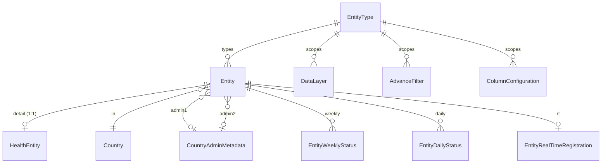

# The Entity subsystem

The most important architectural fact about this codebase: **there are two parallel modelling
systems for mappable points of interest**, and both are live.

---

## Why it exists

The original model was `School` — schools, and only schools, with dedicated statistics tables,
ingestion jobs, a search index and a cache warmer. Extending Giga's map to health facilities,
libraries and other point types by copying that stack per type would not scale.

The **Entity** subsystem generalises it: a shared `Entity` table for everything common (geography,
connectivity, population), a per-type detail table for the rest, and a **database-driven registry**
(`EntityType`) that tells the generic code which tables to use.

`school` is itself registered as an entity type, flagged `is_legacy=True`, meaning "this type is
backed by the old `School` table, not `Entity`".

## The three models



### `EntityType` — the registry

[proco/entities/models.py:22](../../proco/entities/models.py#L22). A **database row**, not a Python
enum:

| Field | Purpose |
|---|---|
| `code` | `school`, `health`, … — short, unique |
| `name`, `description`, `display_order` | Presentation |
| `is_active` | Inactive types are hidden from APIs and UI |
| `is_legacy` | `True` → backed by the old `School` model |
| `detail_model` | e.g. `entities.HealthEntity` |
| `detail_related_name` | e.g. `health_entity` |
| `master_data_model` | e.g. `data_sources.HealthEntityMasterIntermediateData` |
| `extra_config` | JSON — table names, SRID, tile cache prefix |

The seeded rows ([proco/entities/management/commands/seed_entity_types.py:11](../../proco/entities/management/commands/seed_entity_types.py#L11)):

| | `school` | `health` |
|---|---|---|
| `is_legacy` | `True` | `False` |
| `detail_model` | *(empty)* | `entities.HealthEntity` |
| `master_data_model` | `data_sources.SchoolMasterData` | `data_sources.HealthEntityMasterIntermediateData` |
| `extra_config.main_table` | `schools_school` | `entities_entity` |
| `extra_config.tile_master_data_table` | `data_sources_schoolmasterdata` | `data_sources_healthentitymasterintermediatedata` |
| `extra_config.tile_cache_prefix` | `SCHOOL_STATUS_CONNECTIVITY_TILES_MAP` | `V2_ENTITY_TILES_CONNECTIVITY_STATUS` |

> **`code` and `extra_config` table names are interpolated into raw SQL.** `DataLayer.entity_name`
> returns `entity_type.code` explicitly "for use in raw SQL table names and filters"
> ([proco/accounts/models.py:440](../../proco/accounts/models.py#L440)), and the tile generators
> read `main_table` / `tile_master_data_table` from `extra_config`.
>
> This is safe **only because `EntityType` rows are created by a management command and never
> through an API.** There is no endpoint that creates or edits entity types, and there should not
> be one without first parameterising the SQL that consumes these values. Treat the seed file as
> the schema.

### `Entity` — the shared table

[proco/entities/models.py:196](../../proco/entities/models.py#L196), table `entities_entity`.
Mirrors `School` for the common fields — `giga_id`, `external_id`, `name`/`name_lower`, `country`,
`admin1`, `admin2`, `geopoint`, `environment`, `connectivity_status`, `coverage_status`,
`last_weekly_status` — and adds fields `School` lacks:

| Addition | Note |
|---|---|
| `pop_within_5km`, `pop_within_10km` | `School` only has 1/2/3 km |
| `water_availability`, `electricity_availability`, `electricity_type` | Real booleans, not strings |
| `connectivity_govt` | A `BooleanField`, where School Master carries a `'yes'`/`'no'` string |
| `data_source`, `data_collection_year`, `data_collection_modality` | Provenance on the row itself |
| `last_master_status_id` | Pointer back to the master-data row that produced it |

Uniqueness is on `(entity_type, country, giga_id)` — the same Giga ID may exist for different
types.

> **Type consistency is not enforced at the database level.** `entity_type` is nullable
> (`null=True, blank=True`), and `Entity` rows are `on_delete=PROTECT` against `EntityType`. A row
> with `entity_type=NULL` will not match any type-scoped query and becomes invisible without
> erroring. Worth a periodic `Entity.objects.filter(entity_type__isnull=True).count()` check.

### `HealthEntity` — a detail table

[proco/entities/models.py:337](../../proco/entities/models.py#L337), table
`entities_health_entity`. `OneToOneField` to `Entity` with
`limit_choices_to={'entity_type__code': 'health'}`, holding ~40 health-specific fields: DHIS2/HIMS/
HFML identifiers, facility type and level, bed and theatre counts, staff breakdown by role,
emergency services, cold chain, catchment population, and network-infrastructure distances for
telemedicine.

`limit_choices_to` constrains **form and admin choices only** — it is not a database constraint.
Nothing prevents a `HealthEntity` being attached to a non-health `Entity` in code.

---

## Statistics tables

The entity side has its own full set in `connection_statistics`:

| School side | Entity side |
|---|---|
| `SchoolWeeklyStatus` | `EntityWeeklyStatus` |
| `SchoolDailyStatus` | `EntityDailyStatus` |
| `RealTimeConnectivity` | `EntityRealTimeConnectivity` |
| `SchoolRealTimeRegistration` | `EntityRealTimeRegistration` |

`CountryWeeklyStatus` and `CountryDailyStatus` are **shared** — there is no entity-specific country
rollup. Country-level aggregates therefore reflect schools, entities, or some combination
depending on which job last wrote them. Be careful drawing conclusions from country totals while
both pipelines are active.

---

## Duplicated infrastructure

Every piece of school machinery has an entity counterpart:

| Concern | School | Entity |
|---|---|---|
| API namespace | `/api/locations/`, `/api/statistics/` | `/api/v2/entities/` |
| Search index | `giga_schools` | `giga_entities` |
| Index rebuild job | `rebuild_school_index` *(disabled)* | `rebuild_unified_index` |
| Cache warmer | `update_all_cached_values` *(disabled)* | `update_all_entity_cached_values` |
| Master ingestion | `update_static_data` | `update_entity_static_data` |
| Publish handler | `handle_published_school_master_data_row` | `handle_published_entity_master_data_row` |
| Delete handler | `handle_deleted_school_master_data_row` | `handle_deleted_entity_master_data_row` |
| Record update | `update_school_records` | `update_entity_records` |
| RT registration | `populate_school_registration_data` | `populate_entity_registration_data` |
| Live data | `update_live_data` | `update_entity_live_data_from_giga_meter` |
| QoS | `update_qos_data` | `update_entity_qos_data` |
| Master cleanup | `cleanup_school_master_rows` | `cleanup_health_entity_master_rows` |

**25 of the 25 active scheduled jobs belong to one side or the other** — 15 school, 10 entity.

Scoping FKs were added to three `accounts` models, all nullable with the same semantics
(`NULL` = legacy school-only): `DataLayer.entity_type`, `AdvanceFilter.entity_type`,
`ColumnConfiguration.entity_type`.

---

## Current state of the migration

Two beat entries are commented out with an explicit marker
([proco/taskapp/__init__.py:26](../../proco/taskapp/__init__.py#L26)):

```python
# TODO: Comment out once entity code is deployed with new FE
# 1. Old Cache Warmup (replaced by update_all_entity_cached_values)
# 2. Old School Cognitive Search Index Rebuild (replaced by rebuild_unified_index)
```

So cache warming and search indexing have **already** moved to the entity implementations. The
school-side ingestion and aggregation jobs have not.

**The frontend `staging` branch does not call `/api/v2/entities/` at all.** Every URL in
`src/@/*/effects/` targets the v1 namespaces. The entity API is live, tested and scheduled, but
has no consumer yet.

Three feature flags gate entity data flow, and two default to **off**:

| Flag | Default |
|---|---|
| `GIGA_METER_ENABLE_AUTO_SYNC` | `True` |
| `HEALTH_GIGA_METER_ENABLE_AUTO_SYNC` | **`False`** |
| `ENTITY_LIVE_DATA_ENABLE_AUTO_SYNC` | **`False`** |

So on a default configuration the entity pipeline ingests master data but **not** live
connectivity. Check these before concluding that entity live data is broken.

---

## Working in this area

**Adding a field that both sides need** means changing `School` *and* `Entity`, both sets of
statistics models, both ingestion paths, both serializer families. There is no shared base class
between `School` and `Entity` — they are independent models with parallel field lists.

**Adding a new entity type** means: a row in `ENTITY_TYPES_DATA`, a detail model, a master-data
model, a Delta Share schema, column configurations, data layers, advanced filters, and country
activation. The `load_health_entity_*` commands are the template.

**Before changing a school-side job**, check whether its entity counterpart needs the same change.
The two implementations have already diverged — they are not generated from a shared source.

## Seeding

```bash
pipenv run python manage.py seed_entity_types
pipenv run python manage.py load_health_entity_column_configurations
pipenv run python manage.py load_health_entity_data_layers
pipenv run python manage.py load_health_entity_advance_filters
pipenv run python manage.py populate_entity_active_filters_for_countries
```

`seed_entity_types` uses `update_or_create` and is idempotent.

## Related

- [../05-background-jobs/entity-jobs.md](../05-background-jobs/entity-jobs.md)
- [../05-background-jobs/search-index.md](../05-background-jobs/search-index.md)
- [data-model.md](data-model.md)
