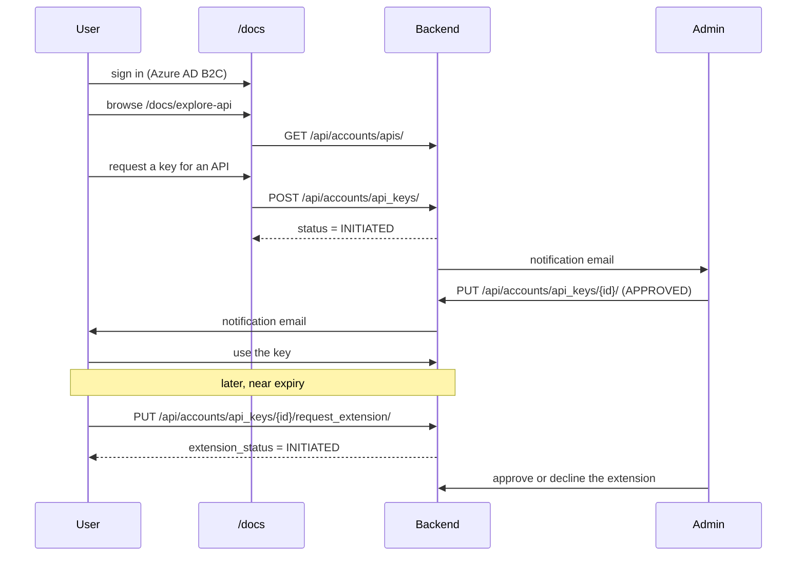
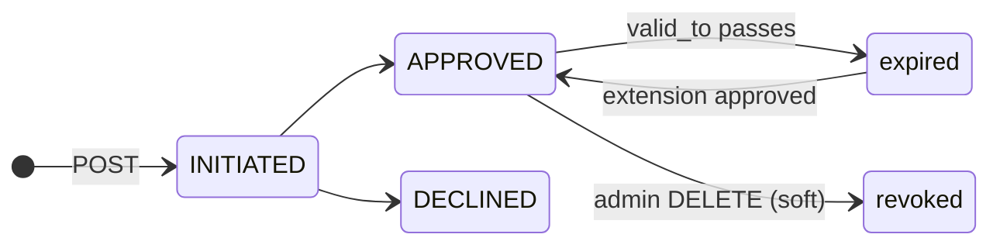

# API key request

How an external consumer gets, uses and renews access to the public API.

**Frontend routes**: `/docs`, `/docs/explore-api`, `/docs/api-keys`, `/docs/api/:apiKey`
**Backend**: [proco/accounts/api.py:164](../../proco/accounts/api.py#L164)

---

## Journey



## Step 1 — Browse the catalogue

`GET /api/accounts/apis/` lists `API` records
([proco/accounts/models.py:13](../../proco/accounts/models.py#L13)):

| Field | Purpose |
|---|---|
| `code`, `name`, `description` | Identity |
| `category` | `public` or `private` — **default is `private`** |
| `documentation_url` | Where the docs live |
| `download_url` | The export endpoint this API grants, if any |
| `report_title` | CSV filename template |
| `default_filters` | JSON — filters baked into every request with this key |

The catalogue is seeded, not created in the UI:

```bash
pipenv run python manage.py load_api_data --api-file ./proco/core/resources/all_apis.tsv
```

APIs are additionally grouped into `APICategory` records, some flagged `is_default`.

## Step 2 — Request a key

`POST /api/accounts/api_keys/`. The key is created with `status = INITIATED`, `valid_from` set
automatically (`auto_now=True`), and optional scoping:

- **Countries** — via `APIKeyCountryRelationship`
- **API categories** — via `APIKeyAPICategoryRelationship`
- **Filters** — a JSON blob on the key itself

A requester sees only their own keys; the queryset branches on `CAN_APPROVE_REJECT_API_KEY`
([proco/accounts/api.py:208](../../proco/accounts/api.py#L208)).

> `valid_from` uses `auto_now=True`, not `auto_now_add=True`, so it is **rewritten on every save**.
> A key approved a month after it was requested will show `valid_from` as the approval date — and
> any later edit moves it again. Treat `valid_from` as "last modified", not "issued".

## Step 3 — Approval

An administrator approves or declines. See
[../04-admin-flows/api-key-approval.md](../04-admin-flows/api-key-approval.md).

Notifications are gated by `ENABLED_API_KEY_EMAILS` (default `True`), with
`API_KEY_ADMIN_DASHBOARD_URL` as the deep link.

## Step 4 — Using the key

### Validation

```
PUT /api/accounts/validate_api_key/
{"api_id": 3, "api_key": "<key>"}
```

Returns the key's API categories, falling back to the API's `is_default` categories when the key has
none. On failure: `404` `{"detail": "Please enter valid api key."}` — identical for a wrong key, an
expired key and a declined key.

> This endpoint requires `IsUserAuthenticated`. It validates a key **for a signed-in user**; it is
> not an anonymous authentication mechanism.

### Downloads

Pass the key in an **`Api-Key` header** (not `Authorization`) to
`/api/locations/schools-download/` or `/api/locations/countries-download/`. The key must belong to
the caller, be approved, unexpired, and bound to that exact download URL. Full rules in
[downloads.md](downloads.md).

## Step 5 — Extension

```
PUT /api/accounts/api_keys/{id}/request_extension/
```

`APIKeysRequestExtensionViewSet` ([proco/accounts/api.py:304](../../proco/accounts/api.py#L304))
sets `extension_valid_to` and `extension_status = INITIATED`. This is a **second, independent
workflow** — `extension_status` is nullable, so `NULL` (never requested) is distinct from
`DECLINED`.

> In the requester's list, keys are sorted by an annotated `custom_order`. Because the first `When`
> clause matches every approved key, the branches intended to surface pending extensions are
> unreachable — a key awaiting extension approval does not stand out. See
> [../04-admin-flows/api-key-approval.md](../04-admin-flows/api-key-approval.md#sort-order).

## Key states



Expiry is evaluated as `valid_to >= today` at use time — there is no job that flips a status.

## Write-access keys

`has_write_access=True` keys are a different category entirely:

- Created only by `create_api_key_with_write_access`, never through the UI.
- **Excluded from every API-key listing** (`.filter(has_write_access=False)`), for admins and
  superusers alike.
- Accepted by `validate_api_key` **from any authenticated user**, not only the owner:
  `Q(user=request_user) | Q(has_write_access=True)`.
- Issued in practice with `valid_till='31-12-2099'`.

They exist for service integrations such as the Daily Check App. Track them outside this system.

## Troubleshooting

| Symptom | Cause |
|---|---|
| `404` "Please enter valid api key" | Wrong key, expired, declined, or not owned by you — all identical |
| Download `400` `InvalidAPIKeyError` | Key valid but bound to a different export, or the API has no `download_url` |
| No approval email | `ENABLED_API_KEY_EMAILS`, Mailjet credentials, or a bounce hidden by `IGNORE_RECIPIENT_STATUS` |
| Key works for one endpoint, not another | Keys are bound to one API via the `download_url` view-name check |
| `valid_from` looks wrong | `auto_now=True` — it is the last-modified date |
