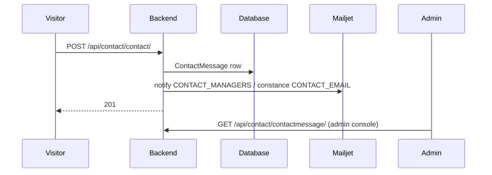

# Contact form

The public "get in touch" form.

| Endpoint | View | Purpose |
|---|---|---|
| `POST /api/contact/contact/` | `CreateContactAPIView` | Submit |
| `GET /api/contact/contactmessage/` | `ContactAPIView` | Admin list |
| `GET /api/contact/contactmessage/{pk}/` | `ContactAPIView` | Admin detail |
| `DELETE /api/contact/contactmessage/` | `ContactAPIView` | Admin delete |

The `contact` app is 303 lines across 9 files — the simplest in the project.

---

## Flow



The model is `ContactMessage` ([proco/contact/models.py:8](../../proco/contact/models.py#L8)),
a `TimeStampedModel`.

## Recipients

Two sources, and it is worth knowing which wins:

| Source | Where |
|---|---|
| `CONTACT_MANAGERS` | Environment, `env.list`, default **`['test@test.test']`** |
| `CONTACT_EMAIL` | **django-constance**, editable at runtime, stored in Redis |

> `CONTACT_MANAGERS` defaults to **`test@test.test`** and is **not in `.env_example`**. An
> environment that has not set it — and has not configured the constance value — sends visitor
> enquiries to a non-existent address. Combined with Anymail's `IGNORE_RECIPIENT_STATUS: True`,
> which suppresses bounce errors, this fails completely silently.
>
> If anyone asks "did we ever reply to the contact form?", check both settings before checking the
> inbox.

Constance is the runtime-editable path:

```python
CONSTANCE_CONFIG = {
    'CONTACT_EMAIL': (env.list('CONTACT_EMAIL', default=[]),
                      'Email to receive contact messages', 'email_input'),
}
```

`CONSTANCE_REDIS_CONNECTION` points at `REDIS_URL` — so the value lives in the same Redis database
as the cache, and **a `FLUSHDB` on db 0 resets it to the environment default**.

## Admin side

`/admin/contact-message` and `/admin/contact-message/view/:id`, gated by:

| Permission | Grants |
|---|---|
| `can_view_contact_message` | Read the queue |
| `can_update_contact_message` | Mark handled |
| `can_delete_contact_message` | Remove (soft) |

## Spam and abuse

> There is **no CAPTCHA, no rate limiting and no honeypot** on this endpoint, and the project
> configures no DRF throttle classes at all. `POST /api/contact/contact/` is open, unauthenticated
> and writes a database row per call. Any rate limiting must come from the ingress layer.

## Failure modes

| Symptom | Cause |
|---|---|
| Messages stored but no email | `CONTACT_MANAGERS` still `test@test.test`, or constance `CONTACT_EMAIL` empty |
| Emails stopped after a Redis flush | Constance value reset to the environment default |
| Bounces invisible | `IGNORE_RECIPIENT_STATUS: True` in `ANYMAIL` |
| Queue filling with spam | No throttling on the endpoint |

## Related

- [../06-integrations/email-and-slack.md](../06-integrations/email-and-slack.md)
- [../04-admin-flows/content-management.md](../04-admin-flows/content-management.md)
