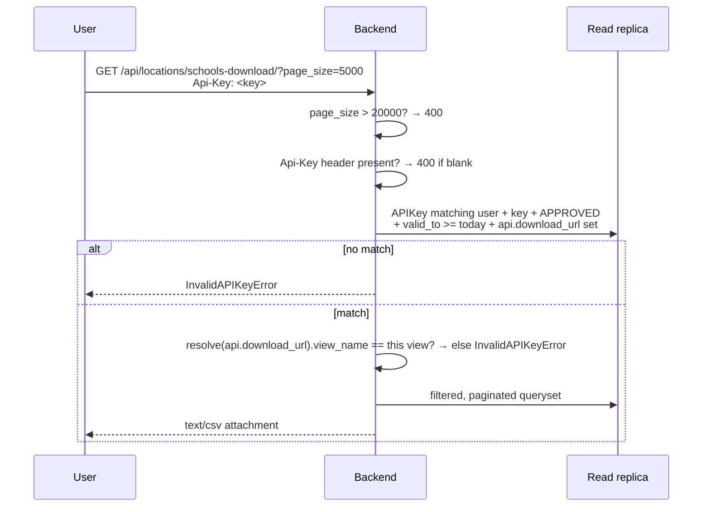

# Downloads (CSV export)

Two public download endpoints, both gated by an **API key** rather than by session authentication
alone.

| Endpoint | URL name | View |
|---|---|---|
| `GET /api/locations/countries-download/` | `download-countries` 🔵 | `DownloadCountriesViewSet` |
| `GET /api/locations/schools-download/` | `download-schools` 🔵 | `DownloadSchoolsViewSet` |

🔵 Both are on the read-replica whitelist and are warmed nightly.

Shared implementation: `DownloadAPIDataToCSVMixin`
([proco/core/mixins.py:46](../../proco/core/mixins.py#L46)).

---

## How a download is authorised



`perform_pre_checks` enforces five conditions in order:

1. **`page_size` ≤ 20 000** (`exports_upper_limit`,
   [proco/core/config.py:37](../../proco/core/config.py#L37)), else `InvalidExportRecordsCountError`.
2. **An `Api-Key` header** is present — note the header name, `Api-Key`, not `Authorization`.
3. **The key belongs to the requesting user** (`user=request.user`), is `APPROVED`, and
   `valid_to >= today`.
4. **The key's API has a `download_url`** configured.
5. **The key's `download_url` resolves to this exact view**:

   ```python
   download_url = urlsplit(str(valid_api_key.api.download_url)).path
   if not is_valid_path(download_url) or \
      resolve(download_url).view_name != request.resolver_match.view_name:
       raise core_exceptions.InvalidAPIKeyError()
   ```

   That last check is the interesting one: it stops a user from taking a key issued for the
   *countries* download and using it against the *schools* download. Keys are bound to one export.

> **The key must belong to `request.user`**, so the caller is authenticated *and* presents a key.
> This is not anonymous API access — it is a second factor on top of a session. Anonymous callers
> cannot download.

## Filename

`get_filename` ([proco/core/mixins.py:84](../../proco/core/mixins.py#L84)) uses
`?report_title=` if supplied; otherwise it builds one from `API.report_title`, or for public APIs:

```
<api name>_<category>_page_<n>_out_of_<total>_dated_<DDMMYYYY_HHMMSS>.csv
```

So the page number and total are encoded in the filename — useful when a large export is fetched
page by page.

## Pagination and the 20 000 cap

```python
if self.apply_query_pagination:
    response = self.get_custom_paginated_response(queryset)
    ...
else:
    # Change the pagination limit to 20K as asked by Client
    self.paginator.max_page_size = core_configs.exports_upper_limit
```

> Exports are **capped at 20 000 rows per request**. A country with more schools than that cannot be
> exported in one call — the client must page. There is no indication in the CSV itself that it is
> partial, beyond the page numbers in the filename.

## Output

`csv.DictWriter`, comma-delimited, `Content-Type: text/csv`, `Content-Disposition: attachment`.
Headers are taken from the keys of the **first row**:

```python
csv_header = list(data[0].keys()) if len(data) > 0 else []
```

An empty result set returns `400` with `{"error": ["No data available"]}` rather than an empty CSV.

> Because headers come from the first row only, any serializer that omits null fields per-row would
> produce a CSV missing columns. The serializers here emit a fixed field set, so this holds — but it
> is a constraint to preserve if you change them.

## Filtering

Downloads run through the same `filter_queryset` as the list endpoints, so every documented filter
applies. The frontend sends the user's current map filters along with the download request, which is
why the export matches what is on screen.

## Replica routing

Both URL names are in `READ_ONLY_DATABASE_ALLOWED_REQUESTS`, so exports read from the replica —
appropriate, since a 20 000-row export with joins is exactly the kind of query that should not
compete with writes.

The replica's `statement_timeout` (300 s in the local compose configuration) is the effective ceiling
on export duration.

## Failure modes

| Response | Cause |
|---|---|
| `400` `InvalidExportRecordsCountError` | `page_size` > 20 000 |
| `400` `RequiredAPIKeyFilterError` | No `Api-Key` header |
| `400` `InvalidAPIKeyError` | Key not found, not approved, expired, not owned by the caller, or bound to a different export |
| `400` `{"error": ["No data available"]}` | Filters matched nothing |
| `504` | Export exceeded the replica `statement_timeout` or gunicorn's 300 s |

## Related

- [api-key-request.md](api-key-request.md) — obtaining a key
- [../04-admin-flows/api-key-approval.md](../04-admin-flows/api-key-approval.md)
- [../07-api-reference/conventions.md](../07-api-reference/conventions.md)
