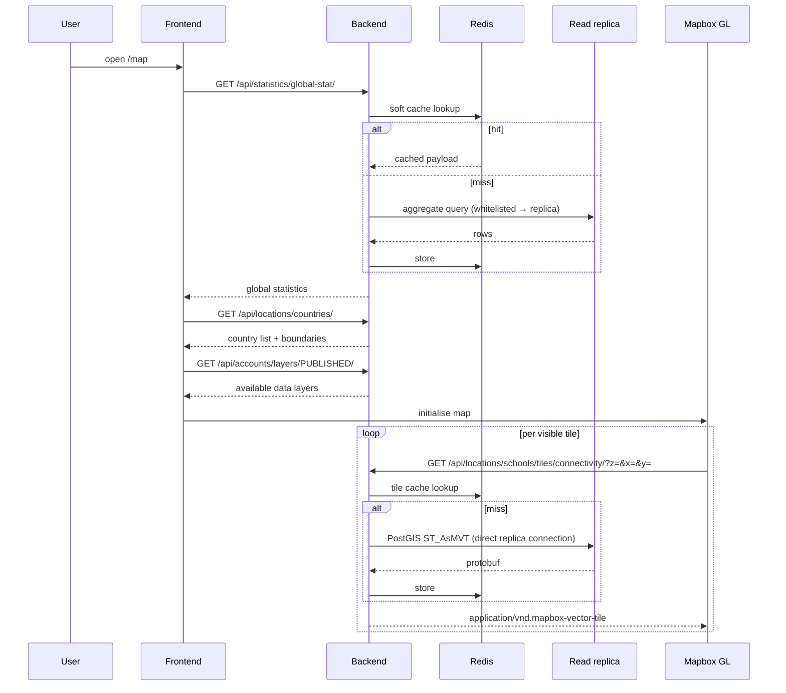

# Map exploration

The default landing experience. `/` redirects to `/map`
([src/core/routes.ts](https://github.com/unicef/giga-maps-frontend/blob/staging/src/core/routes.ts)), which shows a world map of
school connectivity.

**Actors**: anonymous or authenticated — no difference in what is served.

---

## Sequence



## What loads on first paint

| Call | Backend | Cached |
|---|---|---|
| `GET /api/statistics/global-stat/` | `connection_statistics` | Yes — warmed nightly |
| `GET /api/locations/countries/` | `locations.CountryViewSet` | Yes — warmed nightly |
| `GET /api/accounts/layers/PUBLISHED/` | `accounts` | Yes |
| `GET /api/locations/search-countries/` | `CountrySearchStatListAPIView` | Yes — warmed nightly |

All four are pre-computed by `update_all_entity_cached_values` at 04:45 UTC
([proco/utils/tasks.py:59](../../proco/utils/tasks.py#L59)), so the landing page is normally served
entirely from Redis.

## Vector tiles

Three tile endpoints, all under `/api/locations/schools/tiles/`:

| Endpoint | URL name | Handler | Cached |
|---|---|---|---|
| `tiles/` | `tiles-view` | `SchoolTileRequestHandler` | **No** |
| `tiles/connectivity/` | `tiles-connectivity-view` | `ConnectivityTileRequestHandler` | Yes |
| `tiles/connectivity_status/` | `tiles-school-connectivity-status-view` | `SchoolConnectivityStatusTileRequestHandler` | Yes (inherits) |

### How a tile is produced

`BaseTileGenerator` ([proco/schools/api.py:134](../../proco/schools/api.py#L134)):

1. **`path_to_tile`** — parses `z`, `x`, `y` from **query parameters**, assembles them into a
   path string, then regex-matches that string. Not the usual `/z/x/y.pbf` path segments.
2. **`tile_is_valid`** — format must be `pbf` or `mvt`; `x` and `y` must be within `2 ** zoom`.
3. **`tile_to_envelope`** — converts XYZ to an EPSG:3857 bounding box.
4. **`envelope_to_bounds_sql`** — `ST_Segmentize(ST_MakeEnvelope(…, 3857), segSize)` with a
   densify factor of 4.
5. **`envelope_to_sql`** — subclass-specific; builds the `ST_AsMVT` query.
6. **`sql_to_pbf`** — executes and returns the protobuf.

The response is `application/vnd.mapbox-vector-tile` with `Access-Control-Allow-Origin: *` set
directly on it, bypassing `CustomCorsMiddleware`. Tiles are readable from any origin by design.

### Tiles always use the replica

```python
with connections[settings.READ_ONLY_DB_KEY].cursor() as cur:
```

[proco/schools/api.py:182](../../proco/schools/api.py#L182). This is a **direct connection**, not
the request-scoped router — which is why `tiles-connectivity-view` and
`tiles-school-connectivity-status-view` are commented out of
`READ_ONLY_DATABASE_ALLOWED_REQUESTS`. They do not need the whitelist. `tiles-view` *is* on the
whitelist, so it is routed twice over — harmlessly.

> Because the connection is hard-coded, tile rendering **fails entirely if the replica is down**,
> even though the primary is healthy. There is no fallback. A `DatabaseError` returns `204 No
> Content`, which Mapbox renders as an empty tile — so replica trouble looks like "the map lost all
> its schools" rather than an error.

### The row limit

```python
table_configs['limit_condition'] = 'LIMIT ' + request.query_params.get('limit', '50000')
```

[proco/schools/api.py:321](../../proco/schools/api.py#L321).

When no country/admin/school filter is supplied, the limit is overridden by zoom level: 90 000 at
`z=0`, 30 000 at `z=1`, otherwise the 50 000 default. A densely populated tile therefore **silently
truncates** — schools disappear at certain zoom levels with no indication in the response.

### Unparameterised SQL on an unauthenticated endpoint

`ConnectivityTileGenerator.envelope_to_sql`
([proco/schools/api.py:398](../../proco/schools/api.py#L398)) assembles its query with
`sql_tmpl.format(**tbl)` and `sql_to_pbf` runs it through `cur.execute(sql)` with **no
parameters**. Several of the interpolated fragments are built directly from query-string values,
via f-strings, with no casting or validation
([proco/schools/api.py:320-348](../../proco/schools/api.py#L320)):

```python
table_configs['limit_condition']   = 'LIMIT ' + request.query_params.get('limit', '50000')
table_configs['school_condition']  = f" AND schools_school.id = {request.query_params['school_id']}"
table_configs['admin1_condition']  = f" AND schools_school.admin1_id = {request.query_params['admin1_id']}"
table_configs['country_condition'] = f" AND schools_school.country_id = {request.query_params['country_id']}"
# …and the __in variants, which only .strip() each comma-separated element
```

`rt_date_condition` interpolates a parsed date, and `get_filter_sql(...)` contributes further
generated SQL from request parameters.

> **This is a SQL-injection surface on endpoints that require no authentication.** The affected
> parameters are `limit`, `school_id`, `school_id__in`, `admin1_id`, `admin1_id__in`, `country_id`
> and `country_id__in` on `/api/locations/schools/tiles/connectivity/` and
> `/api/locations/schools/tiles/connectivity_status/`. The `__in` variants are the softest target:
> they split on `,` and only `.strip()` each element, so arbitrary text reaches the `IN (...)` list.
>
> The connection used is the **read replica** ([proco/schools/api.py:182](../../proco/schools/api.py#L182)),
> which limits write impact, but it still exposes every table that connection can read.
>
> The fix is mechanical: `int()`-cast the scalar ids with a bounded `limit`, and pass the `__in`
> lists as query parameters rather than interpolating them. This is worth prioritising independently
> of the rest of the documentation work.

### Tile caching

`ConnectivityTileRequestHandler.get_cache_key` builds a key from **every query parameter except
`cache`**, sorted:

```
CONNECTIVITY_TILES_MAP_x_123_y_456_z_7_country_id_44
```

Two consequences:

- Parameter order does not matter (they are sorted) — good.
- Any extra or differently-spelled parameter produces a **different cache key**. A client adding a
  cache-busting parameter, or ordering filters differently, gets a full miss.

`?cache=off` (or `false`) bypasses the cache for that request. The entry is stored with
`soft_timeout=settings.CACHE_CONTROL_MAX_AGE`.

`SchoolTileRequestHandler` has **no caching at all** — every request rebuilds the tile.

## Zoom and filtering

`ConnectivityTileGenerator.query_filters` narrows the SQL when any of these are present:

`country_id`, `country_id__in`, `admin1_id`, `admin1_id__in`, `school_id`, `school_id__in`

Without one of them, the tile query runs unfiltered over `schools_school` and relies on the
envelope intersection plus the `LIMIT` to bound the work.

## Sampling limits

For the non-tile map endpoints:

| Setting | Applies to |
|---|---|
| `COUNTRY_MAP_API_SAMPLING_LIMIT` | Country-level map data |
| `ADMIN_MAP_API_SAMPLING_LIMIT` | Admin-level map data |

Both default to `None` — **unbounded**. `.env_example` suggests 15 000 and 20 000. On a country
with hundreds of thousands of schools, leaving them unset is a reliable multi-second response.

## Failure modes

| Symptom | Cause |
|---|---|
| Map loads, no school dots | Replica down (tiles return `204`), or the `LIMIT` truncated the tile |
| Dots appear then vanish on zoom | Tile `LIMIT` hit at that zoom level |
| Stale statistics | Cache warmer did not run — check `BackgroundTask` for `update_all_entity_cached_values_status_*` |
| Slow first load after deploy | Cache invalidated; warming is nightly, so the first users pay the rebuild |
| Tiles slow but data endpoints fast | Tile endpoints hit the replica directly; check replica lag and `statement_timeout` |

## Related

- [country-view.md](country-view.md) — the next step in the journey
- [filters-and-layers.md](filters-and-layers.md) — changing what the map shows
- [../08-operations/caching-and-performance.md](../08-operations/caching-and-performance.md)
- [../05-background-jobs/cache-warming.md](../05-background-jobs/cache-warming.md)
