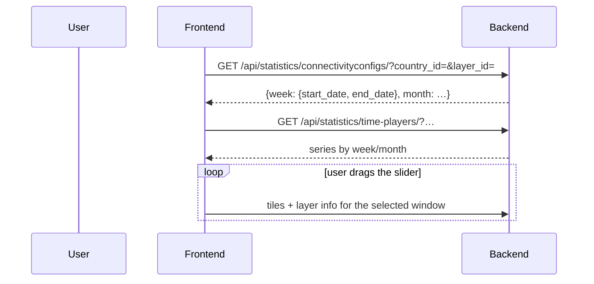

# Time player

The map's time-travel control, replaying connectivity over past weeks and months.

| Endpoint | URL name | Replica |
|---|---|---|
| `GET /api/statistics/time-players/` | `get-time-player-data` | ✓ |
| `GET /api/accounts/time-players/v2/` | `get-time-player-data-v2` | ✗ — **commented out** |
| `GET /api/statistics/connectivityconfigs/` | `get-latest-week-and-month` | ✓ |

---

## How it works



`connectivityconfigs` (`get-latest-week-and-month`) tells the client which week and month have data,
so the slider's range reflects reality rather than the calendar. The cache warmer calls this same
endpoint synchronously with `cache=False` to discover the current week before warming layer data
([proco/utils/tasks.py:96](../../proco/utils/tasks.py#L96)).

## Weekly vs monthly

`is_weekly=true` selects a single ISO week from `start_date`. `is_weekly=false` does something more
involved ([proco/schools/api.py:373](../../proco/schools/api.py#L373)):

```python
dates_on_all_sundays = date_utilities.all_days_of_a_month(year_number, month_number, day_name='sunday').keys()
week_numbers_for_month = [date_utilities.get_week_from_date(d) for d in dates_on_all_sundays]
week_number = SchoolWeeklyStatus.objects.filter(
    year=year_number, week__in=week_numbers_for_month,
).order_by('-week').values_list('week', flat=True).first()
if not week_number:
    week_number = week_numbers_for_month[-1]
```

> Monthly mode does **not** aggregate the month. It picks the **last week of that month that has
> data**, falling back to the last Sunday's week if none does. So a "monthly" view is really
> "the most recent weekly snapshot within the month". That is a reasonable choice for connectivity —
> a point-in-time status rather than an average — but it is not what the label suggests, and it
> means a month with one good week and three bad ones can display as good.

## ISO weeks

The underlying tables are keyed by ISO `(year, week)`. ISO week 1 contains the first Thursday of
January, so early-January dates can fall in week 52/53 of the previous year and late-December dates
in week 1 of the next.

> This is the usual explanation for "the time player shows no data for the first week of January".
> Check the adjacent year before assuming a data gap.

## The v2 endpoint

`/api/accounts/time-players/v2/` (`TimePlayerViewSet` in `accounts`) is the newer implementation.
Its URL name `get-time-player-data-v2` is **commented out** of
`READ_ONLY_DATABASE_ALLOWED_REQUESTS`, so unlike v1 it runs against the **primary** database.

Both versions are live; the frontend calls `api/accounts/time-players/v2/`.

## Performance

Dragging the slider issues a new tile request per step, each with a different `is_weekly`,
`start_date` and `end_date` — and therefore a **different tile cache key**. A user sweeping across a
year generates ~52 cold tile renders per visible tile.

Two mitigations exist:

- `LIVE_LAYER_CACHE_FOR_WEEKS` (default **5**) bounds how many weeks the warmer pre-computes.
- `LIVE_LAYER_CACHE_FOR_COUNTRY_IDS` (default **`['144']`**) restricts that warming to a single
  country by default.

> On an unconfigured environment, time-player warming covers **one country and five weeks**.
> Everything else is rendered on demand. Neither variable has a meaningful value in `.env_example`.

## Failure modes

| Symptom | Cause |
|---|---|
| Slider range too narrow | `connectivityconfigs` reports only weeks with data |
| Empty first week of January | ISO week boundary — check the previous year |
| Monthly view looks wrong | It shows the last week with data, not a monthly average |
| Slider dragging is slow | Cold tile cache per step; warming covers 5 weeks and one country by default |
| v2 slow under load | It runs on the primary database |

## Related

- [map-exploration.md](map-exploration.md)
- [../05-background-jobs/aggregation.md](../05-background-jobs/aggregation.md)
- [../08-operations/caching-and-performance.md](../08-operations/caching-and-performance.md)
