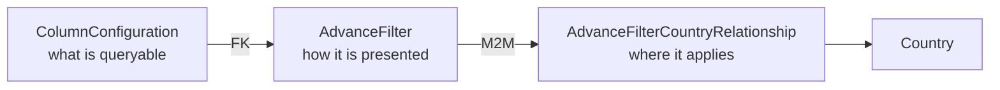
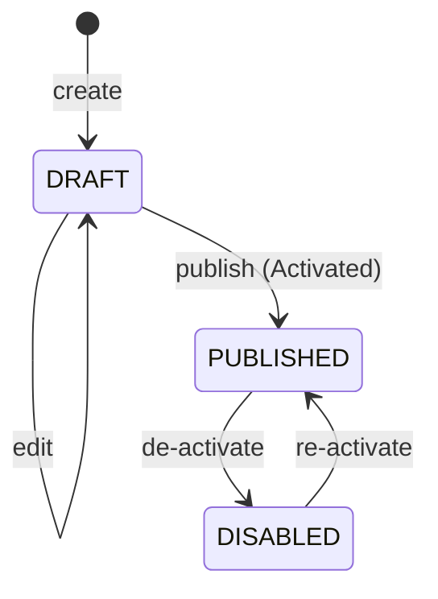

# Advanced filters

An **advanced filter** is an admin-defined control that appears on the public map, letting users
narrow the schools/entities shown — "download speed between X and Y", "education level is
Secondary", "has electricity". Filters are configured per country and published independently.

**Frontend routes**: `/admin/filter`, `/admin/filter/create`, `/admin/filter/edit/:id`
**Backend**: [proco/accounts/models.py:570](../../proco/accounts/models.py#L570)
**Frontend effects**: `src/@/admin/effects/filter-fx.ts`

---

## Two models, one feature



### `ColumnConfiguration` — what can be queried

[proco/accounts/models.py:492](../../proco/accounts/models.py#L492). Describes a single queryable
column, decoupling the filter UI from the physical schema:

| Field | Purpose |
|---|---|
| `name` | Column name in the database |
| `label` | Name shown in the UI |
| `type` | `int`, `float`, `str`, `boolean` |
| `table_name` | Physical table |
| `table_alias` | Alias used when building the query |
| `table_label` | Table name shown in the UI |
| `is_filter_applicable` | Whether a filter may be built on it |
| `options` | JSON — enumerated values for dropdowns |
| `entity_type` | Nullable FK; `NULL` means legacy school-only |

There is exactly **one permission** for column configurations — `can_view_column_configurations`.
They are read-only in the admin console and seeded by management command:

```bash
pipenv run python manage.py load_column_configurations
pipenv run python manage.py load_health_entity_column_configurations
```

This is deliberate. `name`, `table_name` and `table_alias` become part of generated SQL; letting
them be edited through the API would be a SQL-injection surface. **Adding a new filterable column
is a code+deploy operation, not an admin action.**

### `AdvanceFilter` — how it is presented

| Field | Purpose |
|---|---|
| `code` | Unique, **force-uppercased on save** |
| `name`, `description` | Presentation |
| `type` | Widget: `DROPDOWN`, `DROPDOWN_MULTISELECT`, `RANGE`, `INPUT`, `BOOLEAN` |
| `column_configuration` | FK — what it filters on |
| `query_param_filter` | Lookup: `exact`, `iexact`, `contains`, `icontains`, `range`, `on`, `in` |
| `options` | JSON — widget configuration |
| `status` | `DRAFT` → `PUBLISHED` → `DISABLED` |
| `entity_type` | Nullable FK; `NULL` means legacy school-only |

The widget type and the lookup are independent fields, and **nothing validates that they are
compatible**. A `RANGE` widget with `query_param_filter='iexact'`, or a `BOOLEAN` widget with
`range`, will save cleanly and fail at query time. Pair them deliberately:

| Widget | Sensible lookup |
|---|---|
| `DROPDOWN` | `exact` / `iexact` |
| `DROPDOWN_MULTISELECT` | `in` |
| `RANGE` | `range` |
| `INPUT` | `contains` / `icontains` |
| `BOOLEAN` | `on` |

Note the status labels differ from the constants: `PUBLISHED` displays as **"Activated"** and
`DISABLED` as **"De-activated"**. There is no `READY_TO_PUBLISH` — only three states, unlike data
layers.

## Lifecycle



## Endpoints

| Method | Path | Permission |
|---|---|---|
| `GET` | `/api/accounts/adv_filters/` | `can_view_advance_filter` |
| `POST` | `/api/accounts/adv_filters/` | `can_add_advance_filter` |
| `PUT` | `/api/accounts/adv_filters/{id}/` | `can_update_advance_filter` |
| `PUT` | `/api/accounts/adv_filters/{id}/publish/` | `can_publish_advance_filter` |
| `GET` | `/api/accounts/adv_filters/{status}/{country_id}/` | public — what the map calls |
| `GET` | `/api/accounts/adv_filters/{country_id}/all/` | all filters for a country |
| `GET` | `/api/accounts/column_configurations/` | `can_view_column_configurations` |
| `GET` | `/api/accounts/column_configurations/{id}/choices/` | dropdown values |

The map fetches published filters with:

```
GET /api/accounts/adv_filters/PUBLISHED/{country_id}/?expand=column_configuration&ordering=name
```

That exact request — including `expand` and `ordering` — is **pre-warmed nightly** for every country
with at least one school ([proco/utils/tasks.py:88](../../proco/utils/tasks.py#L88)). Calling it
with different query parameters misses the warm cache entirely.

The entity equivalent is `/api/v2/entities/filters/{status}/{country_id}/`.

## Country activation

`AdvanceFilterCountryRelationship` controls where a filter appears. To seed:

```bash
pipenv run python manage.py populate_active_filters_for_countries
pipenv run python manage.py populate_entity_active_filters_for_countries
pipenv run python manage.py load_health_entity_advance_filters
```

## Adding a new filter end to end

1. **Is the column already a `ColumnConfiguration`?** `GET /api/accounts/column_configurations/`.
   If not, it must be added to the seed data and deployed — it cannot be created in the UI.
2. Create the `AdvanceFilter` at `/admin/filter/create`, choosing a widget type and a **compatible**
   lookup.
3. For a dropdown, populate `options` — verify against
   `/api/accounts/column_configurations/{id}/choices/`.
4. Activate it for the relevant countries.
5. Publish.
6. Confirm it appears at
   `/api/accounts/adv_filters/PUBLISHED/{country_id}/?expand=column_configuration&ordering=name`.
   It will not show on the map until the cache refreshes — invalidate, or wait for the 04:45 warmer.

## Related

- [data-layers.md](data-layers.md) — the sibling concept
- [cache-invalidation.md](cache-invalidation.md) — making a new filter appear immediately
- [../03-user-flows/filters-and-layers.md](../03-user-flows/filters-and-layers.md) — the user side
