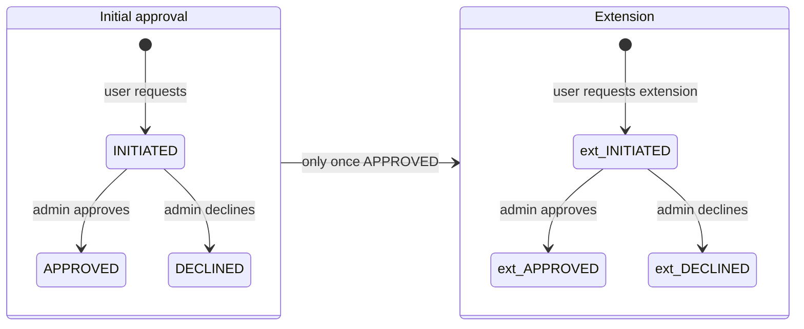

# API key approval

Public API access is granted per user, per API, with an approval step and a separate
expiry-extension workflow. This page covers the **admin** side; the requester's side is
[../03-user-flows/api-key-request.md](../03-user-flows/api-key-request.md).

**Frontend route**: `/admin/api-keys`
**Backend**: [proco/accounts/api.py:164](../../proco/accounts/api.py#L164),
[proco/accounts/models.py:92](../../proco/accounts/models.py#L92)
**Frontend effects**: `src/@/admin/effects/api-request-fx.ts`

---

## The model

`APIKey` ([proco/accounts/models.py:92](../../proco/accounts/models.py#L92)) carries **two
independent approval workflows**:

| Field group | Purpose |
|---|---|
| `status`, `status_updated_by` | Initial approval: `INITIATED` → `APPROVED` / `DECLINED` |
| `extension_valid_to`, `extension_status`, `extension_status_updated_by` | Extension request, same three states |
| `valid_from` (auto), `valid_to` | Validity window |
| `user`, `api` | Who, and for which API |
| `filters` | JSON — query-parameter restrictions baked into the key |
| `has_write_access`, `write_access_reason` | Write-capable keys |

Scoping is through two join tables: `APIKeyCountryRelationship` (which countries) and
`APIKeyAPICategoryRelationship` (which API categories).

## Two lifecycles



`extension_status` is nullable — `NULL` means no extension has ever been requested, which is
distinct from `DECLINED`.

## Who sees what

`apply_queryset_filters` ([proco/accounts/api.py:201](../../proco/accounts/api.py#L201)) is the
same endpoint for users and admins, branching on permission:

```python
has_approval_permission = request_user.permissions.get(CAN_APPROVE_REJECT_API_KEY, False)

queryset = queryset.filter(api__deleted__isnull=True, has_write_access=False)
...
if not is_superuser(request_user) and not has_approval_permission:
    queryset = queryset.filter(user=request_user)
```

Two things worth noting:

> **Write-access keys are invisible in this list.** The unconditional
> `.filter(has_write_access=False)` applies to admins and superusers alike. Keys created by
> `create_api_key_with_write_access` — the ones that can POST and DELETE data — **cannot be
> viewed, audited or revoked through the admin console at all.** They are manageable only via the
> management command and direct database access. If you are auditing who can write to the API,
> this screen will not tell you.

Write-access keys are created out-of-band:

```bash
pipenv run python manage.py create_api_key_with_write_access \
  -user='service@example.org' -api_code='DAILY_CHECK_APP' \
  -reason='Post/Delete control over DailyCheckApp' -valid_till='31-12-2099' \
  --force_user -first_name='Service' -last_name='Account'
```

The commented examples in [web-worker.sh](../../web-worker.sh) show real ones being issued with
`valid_till='31-12-2099'` — effectively permanent.

## Sort order

Both branches annotate a `custom_order` to surface what needs attention — but they are ordered
differently, and only one of them works.

**Admin branch** (has `CAN_APPROVE_REJECT_API_KEY`), most-specific first — **correct**:

| Order | Condition |
|---:|---|
| 1 | `status=INITIATED` — awaiting first approval |
| 2 | `status=APPROVED, extension_status=INITIATED` — awaiting extension approval |
| 3 | `status=APPROVED, extension_status=APPROVED` |
| 4 | `status=APPROVED` |

**Requester branch**, least-specific first — **broken**:

```python
custom_order=Case(
    When(status='APPROVED', then=Value(1)),
    When(status='APPROVED', extension_status='APPROVED', then=Value(2)),
    When(status='APPROVED', extension_status='INITIATED', then=Value(3)),
    When(status='INITIATED', then=Value(4)),
    output_field=IntegerField(),
)
```

> Django's `Case`/`When` returns the **first** matching branch. Because branch 1 matches every
> approved key regardless of extension status, branches 2 and 3 are **unreachable** — every approved
> key sorts as `1`, and a key awaiting extension approval does not stand out in the requester's own
> list. Reordering the `When` clauses to match the admin branch would fix it.
>
> In both branches, `status=DECLINED` matches nothing and gets `custom_order=NULL`.

## Filtering

| Query parameter | Effect |
|---|---|
| `status` | `iexact`, `in`, `exact` |
| `user_id` | `exact`, `in` |
| `country_id` / `country_id__in` | Keys scoped to those countries |
| `api_category_id` / `api_category__in` | Keys scoped to those categories |
| `search` | Across `api__name`, `user__first_name`, `user__last_name`, `user__email` |
| `expand` | `user`, `api`, `status_updated_by` |

The admin console requests:

```
accounts/api_keys/?page_size=20&page=1&expand=user,api&ordering=-status
```

## Actions

| Action | Method | Endpoint | Permission |
|---|---|---|---|
| Approve / decline | `PUT` | `/api/accounts/api_keys/{id}/` | `can_approve_reject_api_key` |
| Approve / decline extension | `PUT` | `/api/accounts/api_keys/{id}/` | `can_approve_reject_api_key` |
| Revoke | `DELETE` | `/api/accounts/api_keys/{id}/` | `can_delete_api_key` |
| Manage categories | `PUT` | `/api/accounts/api_keys/{id}/categories/` | `can_approve_reject_api_key` |

Revocation is a **soft delete**. The key row remains; validation excludes it because
`BaseManager` filters `deleted__isnull=True`.

## Notifications

`ENABLED_API_KEY_EMAILS` (default `True`) controls lifecycle emails. `API_KEY_ADMIN_DASHBOARD_URL`
is the deep link embedded in them. Turn the flag off in any environment sharing a mail provider
with production.

## How a key is validated at request time

`ValidateAPIKeyViewSet` ([proco/accounts/api.py:345](../../proco/accounts/api.py#L345)),
`PUT /api/accounts/validate_api_key/`:

```python
queryset = APIKey.objects.all().filter(
    Q(user=request_user) | Q(has_write_access=True),
    api__deleted__isnull=True,
    api_id=request.data.get('api_id'),
    api_key=request.data.get('api_key'),
    status=APIKey.APPROVED,
    valid_to__gte=get_current_datetime_object().date(),
)
```

Five conditions must hold: the API is not deleted, the id and key match, the status is `APPROVED`,
and `valid_to` is today or later.

> The `Q(user=request_user) | Q(has_write_access=True)` clause means a **write-access key is
> accepted from any authenticated user**, not only its owner. Combined with the fact that
> write-access keys are hidden from the admin list and are often issued with far-future expiry,
> these keys deserve to be tracked outside this system.

On success the endpoint returns the key's API categories, falling back to the API's default
categories when the key has none. On failure: `404` with `"Please enter valid api key."` — the same
response for a wrong key, an expired key and a declined key, which is good practice for not leaking
key state, but does make support harder. Check `status` and `valid_to` directly when diagnosing.

Note this endpoint requires `IsUserAuthenticated` — so it validates a key *for a logged-in user*,
rather than acting as the authentication mechanism for anonymous API traffic.

## Related

- [../03-user-flows/api-key-request.md](../03-user-flows/api-key-request.md) — the request side
- [../07-api-reference/conventions.md](../07-api-reference/conventions.md) — using a key
- [auth-and-rbac.md](auth-and-rbac.md) — the two relevant permissions
