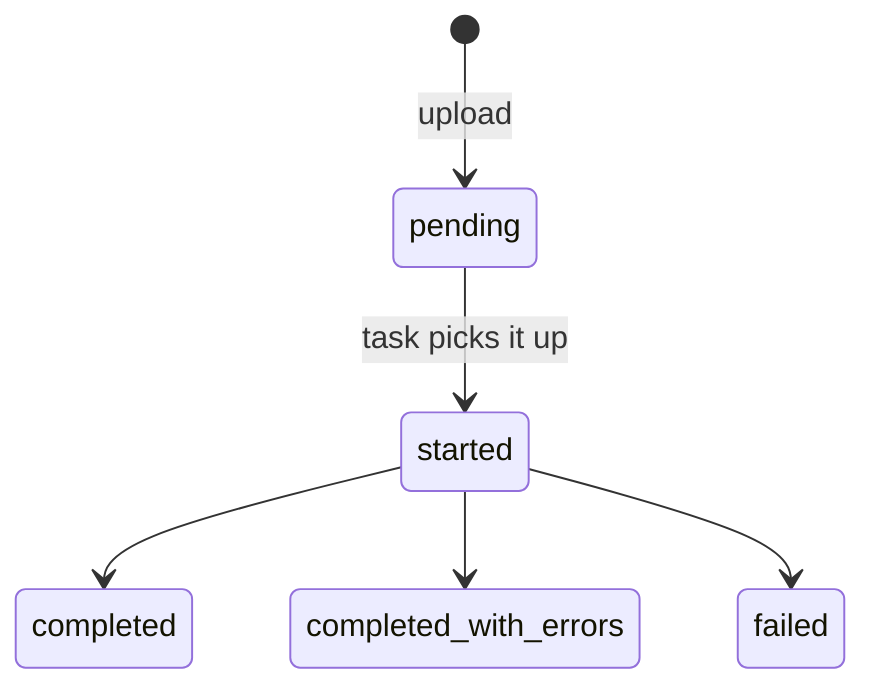

# Country and school data

Direct CRUD over countries, schools and their statistics tables — the escape hatch for data that
cannot wait for the master-data pipeline, plus bulk CSV import.

| Frontend route | Endpoint |
|---|---|
| `/admin/country`, `/admin/country/country/add`, `/admin/country/country/edit/:id` | `locations/country/` |
| `/admin/country/country-summary/*` | `statistics/countryweeklystatus/` |
| `/admin/country/country-daily-summary/*` | `statistics/countrydailystatus/` |
| `/admin/schools`, `/admin/schools/school/add`, `/admin/schools/school/edit/:id` | `locations/schools/school/` |
| `/admin/schools/school-summary/*` | `statistics/schoolweeklystatus/` |
| `/admin/schools/school-daily-summary/*` | `statistics/schooldailystatus/` |
| CSV import | `locations/schools/fileimport/` |

---

## Permissions

| Area | Slugs |
|---|---|
| Countries | `can_view_country`, `can_add_country`, `can_update_country`, `can_delete_country` |
| Schools | `can_view_school`, `can_add_school`, `can_update_school`, `can_delete_school` |
| CSV | `can_view_uploaded_csv`, `can_import_csv`, `can_delete_csv` |

## Editing statistics directly

The four statistics endpoints expose full `GET/POST/PUT/DELETE` over `CountryWeeklyStatus`,
`CountryDailyStatus`, `SchoolWeeklyStatus` and `SchoolDailyStatus`.

> **Edits here are transient.** These tables are recomputed by the nightly aggregation jobs
> (`update_school_records` at 01:00, and `finalize_previous_day_data` on every live-data run) from
> the underlying raw measurements. Correcting a weekly row by hand fixes the symptom until the next
> aggregation overwrites it.
>
> Use these endpoints for genuinely unrecoverable historical data, and fix live problems at the
> source — re-pull and `redo_aggregations` instead. See
> [../08-operations/runbooks.md](../08-operations/runbooks.md#6-aggregations-look-wrong).

Editing a school's `connectivity_status` directly has the same problem: `update_school_records`
recomputes it from `SchoolWeeklyStatus` every night at 01:00.

## Country onboarding

Creating a country is the first step in onboarding; the sequence that follows is:

1. Create the country with `code` and `iso3_format`. **`iso3_format` must match the Delta Share
   table name** — that is how ingestion finds the country's data.
2. Load its admin boundaries (`load_country_admin_data`) and UI labels
   (`populate_admin_ui_labels`).
3. Confirm it is not in `SCHOOL_MASTER_COUNTRY_EXCLUSION_LIST`, and **is** in
   `HEALTH_MASTER_COUNTRY_INCLUSION_LIST` if health data is wanted.
4. Activate data layers and filters (`populate_active_data_layer_for_countries`,
   `populate_active_filters_for_countries`).
5. `POST /api/locations/mark-as-joined/` to set the integration status.
6. Bulk-publish the first master-data import via
   `PUT /api/sources/school_master/country-publish/` — per-row review does not scale to a first
   import of hundreds of thousands of schools.

> `Country.code` has **no unique constraint**, and the country detail endpoint looks up by
> `LOWER(code)` with `get_object_or_404`. A duplicate code makes that endpoint return **`500`**, not
> `404`. Check for collisions before creating a country.

## CSV import

`ImportCSVViewSet` ([proco/schools/api.py:905](../../proco/schools/api.py#L905)),
`POST /api/locations/schools/fileimport/import_csv_data`.

```python
imported_file = FileImport.objects.create(
    uploaded_file=request.FILES['uploaded_file'], uploaded_by=request.user,
)
action_log(request, [imported_file], 1, '', self.model, field_name='uploaded_file')
process_loaded_file.delay(imported_file.id, force=request.POST['force'])
```

Upload is recorded, logged to the audit trail, and processed asynchronously by
`process_loaded_file` ([proco/schools/tasks.py:72](../../proco/schools/tasks.py#L72), 4-hour limit).

### Status lifecycle

`FileImport` ([proco/schools/models.py:119](../../proco/schools/models.py#L119)):



| Field | Purpose |
|---|---|
| `status` | `pending`, `started`, `completed`, `failed`, `completed_with_errors` |
| `errors` | Per-row error text |
| `statistic` | Summary of what was imported |
| `country` | Inferred from the file by `_find_country` |

`completed_with_errors` is the one to watch — the import succeeded but some rows were skipped.
Always read `errors` after an import rather than trusting the status alone.

> `request.POST['force']` is accessed **without a default**, so a POST omitting `force` raises
> `MultiValueDictKeyError` → `500`. The frontend always sends it; a direct API call may not.

`force=True` overrides safety checks in `process_loaded_file`. Be deliberate.

### Cleaning a file first

```bash
pipenv run python manage.py clearcsv
```

Strips erroneous lines before import.

## Merging duplicate schools

```bash
pipenv run python manage.py merge_schools \
  -old_id=123 -new_id=456 -year=2026 --delete_old --redo_aggregations
```

`--redo_aggregations` re-runs the rollups so country totals stay consistent. Without it, counts are
wrong until the next aggregation cycle.

## Search quirk

`ImportCSVViewSet.get_queryset` overrides `search` with an exact country-name match OR a
case-insensitive status match:

```python
Q(country__name=self.request.query_params.get('search')) |
Q(status__icontains=self.request.query_params.get('search'))
```

Country name matching is **exact and case-sensitive**, so searching `brazil` finds nothing while
`Brazil` works. Status matching is fuzzy.

## Related

- [school-master-review-publish.md](school-master-review-publish.md) — the preferred path for school data
- [../05-background-jobs/aggregation.md](../05-background-jobs/aggregation.md)
- [../08-operations/management-commands.md](../08-operations/management-commands.md)
