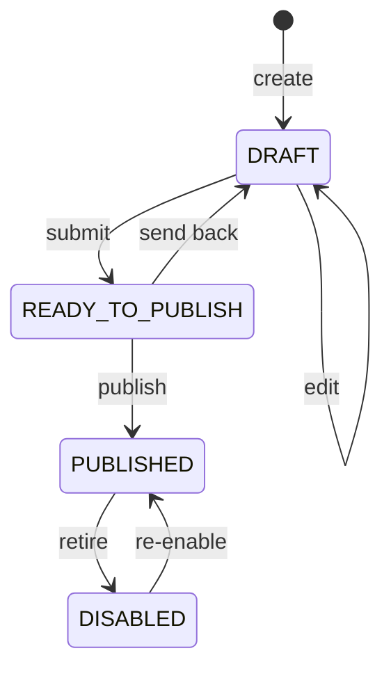

# Data layers

A **data layer** is an admin-defined visualisation on the map: a named, versioned, country-scoped
view over a metric, with a legend, benchmarks and a draft→published lifecycle. Layers are what turn
raw statistics into the coloured dots and choropleths users see.

**Frontend routes**: `/admin/giga-layer`, `/admin/giga-layer/create`,
`/admin/giga-layer/view/:id`, `/admin/giga-layer/edit/:id`
**Backend**: [proco/accounts/models.py:339](../../proco/accounts/models.py#L339),
[proco/accounts/api_urls.py](../../proco/accounts/api_urls.py)
**Frontend effects**: `src/@/admin/effects/giga-layer-fx.ts`

---

## The model

| Field | Purpose |
|---|---|
| `code` | Unique identifier, **force-uppercased on save** |
| `name`, `description`, `version`, `icon` | Presentation |
| `type` | `LIVE` or `STATIC` |
| `category` | `CONNECTIVITY` or `COVERAGE` |
| `entity_type` | FK to `EntityType`, nullable — see [Entity awareness](#entity-awareness) |
| `applicable_countries` | JSON list |
| `global_benchmark` | JSON dict — the worldwide threshold |
| `legend_configs` | JSON list — the colour bands |
| `is_reverse` | Inverts the legend (lower is better, e.g. latency) |
| `status` | `DRAFT` → `READY_TO_PUBLISH` → `PUBLISHED` / `DISABLED` |
| `published_by`, `published_at` | Approval audit |

Two join models:

- `DataLayerDataSourceRelationship` — which `DataSource` rows feed the layer.
- `DataLayerCountryRelationship` — per-country activation, carrying an `is_default` flag that marks
  the layer shown when a user first opens that country.

## Data sources

A layer draws from one or more `DataSource` records
([proco/accounts/models.py:255](../../proco/accounts/models.py#L255)), each of type
`SCHOOL_MASTER`, `DAILY_CHECK_APP`, `QOS` or `HEALTH_MASTER`, and each carrying two JSON blobs:

```python
request_config = {
    'url': 'https://…/api/v1/measurements',
    'method': 'get',
    'headers': {'Content-Type': 'application/json', 'Authorization': 'Bearer …'},
}

column_config = [{
    'name': 'connectivity_status',
    'type': 'str',
    'aggregation_applicable': False,
    'aggregation_options': [],     # Sum, min, max, avg, median, mean
    'is_parameter': True,
    'alias': 'Connectivity Status',
}]
```

> `request_config` can contain a **bearer token in plain text** in the database, as the committed
> docstring example shows. It is returned by `GET /api/accounts/data_sources/`, which the admin
> console calls. Treat data-source read access as credential access.

`DataSource` has its own independent `DRAFT → READY_TO_PUBLISH → PUBLISHED → DISABLED` lifecycle and
its own publish endpoint, `PUT /api/accounts/data_sources/{id}/publish/`. A published layer pointing
at an unpublished source will not resolve — the admin console filters the source picker with
`?data_source_type__in={type}&status=PUBLISHED`.

## Lifecycle



Unlike master data, there is **no two-role handoff** — `can_update_data_layer` and
`can_publish_data_layer` can sit on the same role, and commonly do.

## Endpoints

| Method | Path | Permission | Purpose |
|---|---|---|---|
| `GET` | `/api/accounts/layers/` | `can_view_data_layer` | List; supports `expand=created_by,last_modified_by,published_by` |
| `POST` | `/api/accounts/layers/` | `can_add_data_layer` | Create |
| `PUT` | `/api/accounts/layers/{id}/` | `can_update_data_layer` | Update |
| `PUT` | `/api/accounts/layers/{id}/publish/` | `can_publish_data_layer` | Set status |
| `GET` | `/api/accounts/layers/{id}/preview/` | `can_preview_data_layer` | Render against live data before publishing |
| `GET` | `/api/accounts/layers/{id}/metadata/` | `can_view_data_layer` | Layer metadata |
| `GET` | `/api/accounts/layers/{id}/info/` | public | The data the map draws |
| `GET` | `/api/accounts/layers/{id}/map/` | public | Map-shaped payload |
| `GET` | `/api/accounts/layers/{status}/` | public | e.g. `/layers/PUBLISHED/` — what the frontend requests |

`info` and `map` are the hot public endpoints. `info` is on the read-replica whitelist
(`info-data-layer` in `READ_ONLY_DATABASE_ALLOWED_REQUESTS`); **`map-data-layer` is commented out**
of that list, so `/map/` currently hits the primary database. See
[../08-operations/caching-and-performance.md](../08-operations/caching-and-performance.md).

## Preview

`can_preview_data_layer` is a separate permission because preview runs the layer's full query
against live data for an unpublished configuration — an uncached, unbounded read. The frontend
effect is `getDataPreviewFx` hitting `/accounts/layers/{id}/preview/`.

Give preview sparingly on production. A misconfigured layer previewed against a large country is
an easy way to saturate the database.

## Country activation and defaults

`DataLayerCountryRelationship` decides which layers appear for which country, and which is
pre-selected. The cache warmer reads this to decide what to pre-compute
([proco/utils/tasks.py:66](../../proco/utils/tasks.py#L66)):

```python
DataLayerCountryRelationship.objects.filter(
    Q(is_default=True) | Q(
        is_default=False,
        data_layer__category=DataLayer.LAYER_CATEGORY_CONNECTIVITY,
        data_layer__created_by__isnull=True,
    ),
    data_layer__type=DataLayer.LAYER_TYPE_LIVE,
    data_layer__status=DataLayer.LAYER_STATUS_PUBLISHED,
    ...
)
```

Read that filter carefully — it warms the default layer **plus** every system-created
(`created_by__isnull=True`) connectivity layer. A layer created by an administrator is *not*
warmed unless it is also the country default. **An admin-created layer that becomes popular will
be consistently slower than a system layer**, and nothing in the UI indicates this.

To seed country activation:

```bash
pipenv run python manage.py populate_active_data_layer_for_countries --reset
```

## Entity awareness

`DataLayer.entity_type` is a nullable FK, and:

```python
@property
def entity_name(self):
    """Returns the entity type code string for use in raw SQL table names and filters."""
    if self.entity_type:
        return self.entity_type.code
    return 'school'
```

The layer's entity type is **interpolated into raw SQL table names**. A layer with no entity type
falls back to `'school'`, which is why existing layers kept working when the entity subsystem
landed.

> Because `entity_name` feeds raw SQL, `EntityType.code` is effectively a trusted identifier.
> `EntityType` rows are created by the `seed_entity_types` management command rather than through
> the API, which is what keeps this safe. Do not add an API path that lets users create entity
> types with arbitrary codes without revisiting the SQL construction.

## Seeding

```bash
# System layers and their data sources
pipenv run python manage.py load_system_data_layers --delete_data_sources --update_data_sources --update_data_layers

# Health-entity layers
pipenv run python manage.py load_health_entity_data_layers
```

## Related

- [advanced-filters.md](advanced-filters.md) — the sibling concept, same lifecycle shape
- [../03-user-flows/filters-and-layers.md](../03-user-flows/filters-and-layers.md) — how users consume layers
- [../08-operations/caching-and-performance.md](../08-operations/caching-and-performance.md) — why warming matters here
