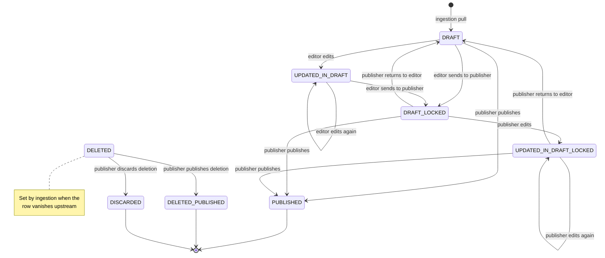
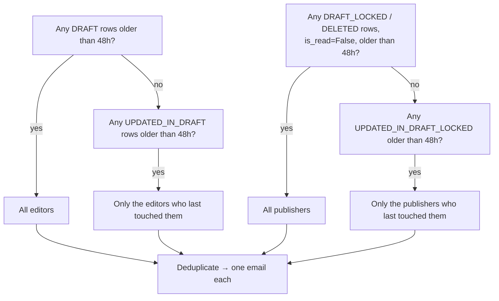

# Master-data review and publish

The most intricate admin flow in the system: a two-role editorial workflow over data pulled from
Giga's data platform, with an eight-state machine and per-role queue filtering.

**Frontend routes**: `/admin/data-source`, `/admin/data-source/edit/:id`
([src/core/routes.ts](https://github.com/unicef/giga-maps-frontend/blob/staging/src/core/routes.ts))
**Backend**: [proco/data_sources/api.py](../../proco/data_sources/api.py),
[proco/data_sources/serializers.py](../../proco/data_sources/serializers.py)
**Model**: `MasterDataSourceModelMixin` at [proco/core/models.py:154](../../proco/core/models.py#L154)

---

## Roles

Two permissions define the workflow. A user's queue and permitted transitions follow from which
they hold.

| Permission | Role in the flow |
|---|---|
| `can_update_school_master_data` | **Editor** — reviews and corrects incoming rows |
| `can_publish_school_master_data` | **Publisher** — approves rows into the live database |
| `can_view_school_master_data` | Read-only access to the queue |

The code derives two booleans from these
([proco/data_sources/api.py:155](../../proco/data_sources/api.py#L155)):

```python
is_publisher   = perms.get(CAN_PUBLISH_SCHOOL_MASTER_DATA, False)
is_editor_only = (not perms.get(CAN_PUBLISH_SCHOOL_MASTER_DATA, False)
                  and perms.get(CAN_UPDATE_SCHOOL_MASTER_DATA, False))
```

Note the asymmetry: **`is_publisher` does not exclude editors.** A user holding both permissions is
treated as a publisher everywhere, and loses access to the editor-only transitions. Granting
"publish" to an editor silently removes abilities rather than adding them.

## The state machine



| State | Label in UI | Meaning |
|---|---|---|
| `DRAFT` | In Draft | Freshly pulled, untouched |
| `UPDATED_IN_DRAFT` | UPDATED BY EDITOR | An editor changed it |
| `DRAFT_LOCKED` | ASSIGNED To PUBLISHER | Editor handed it over |
| `UPDATED_IN_DRAFT_LOCKED` | UPDATED BY PUBLISHER | Publisher changed it |
| `PUBLISHED` | Published | Approved; awaiting the apply job |
| `DELETED` | Deleted | Upstream removed it; awaiting approval |
| `DELETED_PUBLISHED` | Published Deleted | Deletion approved |
| `DISCARDED` | Discarded | Deletion rejected |

## Transition rules

Enforced in `_validate_status`
([proco/data_sources/serializers.py:301](../../proco/data_sources/serializers.py#L301)). Every
violation raises `InvalidSchoolMasterDataRowStatusAtUpdateError` carrying `{old, new}`.

| Target status | Who may set it | From which states |
|---|---|---|
| `PUBLISHED`, `DELETED_PUBLISHED`, `DELETED`, `DISCARDED` | **Nobody** via the update API — publish has its own endpoint | — |
| `DRAFT` | Publisher only | `DRAFT_LOCKED`, `UPDATED_IN_DRAFT_LOCKED` |
| `UPDATED_IN_DRAFT` | Editor only (publishers are rejected) | `DRAFT`, `UPDATED_IN_DRAFT` |
| `DRAFT_LOCKED` | Editor only | anything except `DRAFT_LOCKED` / `UPDATED_IN_DRAFT_LOCKED` |
| `UPDATED_IN_DRAFT_LOCKED` | Publisher only | anything except `UPDATED_IN_DRAFT` |

When the request omits `status`, a default is inferred from the caller's role:
publisher → `UPDATED_IN_DRAFT_LOCKED`, editor → `UPDATED_IN_DRAFT`. A user with neither permission
gets `InvalidSchoolMasterDataRowStatusAtUpdateError` with `new=None`, which surfaces as a confusing
error message rather than a 403.

## Queue filtering

Each role sees a different queue. `apply_queryset_filters`
([proco/data_sources/api.py:139](../../proco/data_sources/api.py#L139)) first drops finished work:

```python
queryset = queryset.exclude(
    status__in=[PUBLISHED, DELETED_PUBLISHED, DISCARDED],
    is_read=True,
)
```

> This is a **single `exclude` with two conditions**, so it removes rows that are finished *and*
> already applied. A `PUBLISHED` row with `is_read=False` — i.e. published but not yet processed by
> the 4-hourly apply job — **remains visible in the queue**. Reviewers routinely see rows they have
> just published still sitting in the list for up to four hours. This is by design (it reflects
> "not yet live"), but it is the single most common source of "did my publish work?" questions.

Then, by role:

| Role | Sees |
|---|---|
| Publisher | `DRAFT`, `DRAFT_LOCKED`, `UPDATED_IN_DRAFT_LOCKED`, `DELETED` |
| Editor only | `DRAFT`, `UPDATED_IN_DRAFT` |
| Viewer only | everything not excluded above |

Note the code comment for the publisher branch says *"To publisher show only LOCK or UPDATED in
LOCKED status rows"*, but the list also includes `DRAFT` and `DELETED`. The code is correct for the
workflow (a publisher must be able to publish an untouched row and approve deletions); the comment
is stale.

## Publishing

Three endpoints, all requiring `CanPublishSchoolMasterData`:

| Endpoint | Scope |
|---|---|
| `PUT /api/sources/school_master/<pk>/publish/` | One row |
| `PUT /api/sources/school_master/publish/` | A list of ids in the body |
| `PUT /api/sources/school_master/country-publish/` | Every pending row for given countries |

### What publishing does

`PublishSchoolMasterDataSerializer.update`
([proco/data_sources/serializers.py:417](../../proco/data_sources/serializers.py#L417)):

1. Maps the status — `DELETED` → `DELETED_PUBLISHED`, everything else → `PUBLISHED`.
2. Validates: rows already in `UPDATED_IN_DRAFT`, `PUBLISHED` or `DELETED_PUBLISHED` are rejected
   with `InvalidSchoolMasterDataRowStatusError`. **An `UPDATED_IN_DRAFT` row cannot be published
   directly** — the editor must send it to the publisher first.
3. Stamps `published_at` and `published_by`.
4. **`delete_all_related_rows`** — hard-deletes every other `SchoolMasterData` row sharing the same
   `school_id_giga`:

   ```python
   SchoolMasterData.objects.filter(
       school_id_giga=instance.school_id_giga,
   ).exclude(pk=instance.id).delete()
   ```

   > This is a real `DELETE`, across **all countries and all statuses**, filtered only on
   > `school_id_giga`. If the same Giga ID ever appeared under two countries, publishing one
   > destroys the other's pending review row. Giga IDs are unique per country by constraint on
   > `School`, but nothing enforces that on the staging table.

5. **`update_all_related_models`** — calls `handle_published_school_master_data_row(published_row=…,
   publish_source='admin_portal_selected')` **synchronously, without `.delay()`**, so the apply work
   happens inside the HTTP request.

The country-publish endpoint does use `.delay()`
([proco/data_sources/api.py:373](../../proco/data_sources/api.py#L373)), so it returns immediately.
Per-row publish does not. Publishing a row that touches a school with a long history can therefore
block the request thread for a noticeable time.

## Discarding a deletion

`DELETE` on the row set, handled by `destroy`
([proco/data_sources/api.py:216](../../proco/data_sources/api.py#L216)). Only rows in `DELETED`
with `is_read=False` are affected; they move to `DISCARDED` with `is_read=True`. Anything else is a
no-op returning `400`.

## No UI discard for an ordinary row

Editors and publishers can reject a *deletion* (see above), but there is no console action to
discard an ordinary `DRAFT` / `UPDATED_IN_DRAFT` / `DRAFT_LOCKED` row you simply don't want to keep.

> **Operational note (not yet verified from code).** The backend supports discarding a row, but nothing in
> the admin UI exposes it. In practice, staging rows are left alone until the next ingestion pull
> from School Master overwrites the draft with the latest upstream record — the pull is the de facto
> "reset". Where a row needs to be removed sooner, it is discarded manually via the Django shell/ORM
> rather than through any documented command. Worth turning into a real admin action or a
> `data_cleanup` flag rather than an ad hoc ORM query each time.

## Review reminders

`email_reminder_to_editor_and_publisher_for_review_waiting_records` runs daily at **08:10 UTC**
([proco/data_sources/tasks.py:659](../../proco/data_sources/tasks.py#L659)) and nags people about
rows older than `SCHOOL_MASTER_REVIEW_GRACE_PERIOD_IN_HRS` (default 48).

Its targeting logic is more careful than a broadcast:



Two preconditions short-circuit the whole task, each logged to `BackgroundTask.log`:

- `ENABLED_DATA_SOURCES_EMAILS` is false
- Mailjet credentials are blank

> The grace period governs **reminders only**. Nothing auto-publishes. A row can sit in `DRAFT`
> indefinitely; the system will keep emailing about it.

> This task carries no `@app.task` time-limit arguments, so it inherits the worker CLI default of
> **60 seconds soft / 300 hard**. It sends one email per unique recipient after building four
> queries over the staging table. On a large backlog with many reviewers, it can be killed
> mid-send — leaving some reviewers notified and others not, with no retry.

## Cross-country publishing

`SchoolMasterDataPublishByCountryViewSet`
([proco/data_sources/api.py:309](../../proco/data_sources/api.py#L309)) publishes every eligible row
for a set of countries, then dispatches both the publish and delete handlers asynchronously with
`publish_source='admin_portal_country'`. This is the intended tool for onboarding a new country —
per-row review does not scale to a first import of hundreds of thousands of schools.

## Health entities

The identical workflow applies to `HealthEntityMasterIntermediateData`, which inherits the same
`MasterDataSourceModelMixin`. The permission slugs are the school ones — there is no separate
`can_publish_health_entity_master_data`. Anyone who can publish schools can publish health
facilities.

## Related

- [../05-background-jobs/ingestion-master-data.md](../05-background-jobs/ingestion-master-data.md) — where the rows come from and what happens after publish
- [auth-and-rbac.md](auth-and-rbac.md) — the full permission list
- [../08-operations/runbooks.md](../08-operations/runbooks.md) — replaying a specific upstream version
