# Background jobs

All scheduled work is Celery, scheduled by **RedBeat** (schedule stored in Redis under the
`gigamaps:` prefix), defined in one place:
[proco/taskapp/__init__.py](../../proco/taskapp/__init__.py).

**25 jobs are active.** Two more are present but commented out. All times are **UTC**.

> The task table in the repository root [README.md](../../README.md) is stale — it lists 13 jobs
> including `clean_old_realtime_data`, which no longer exists. This page is authoritative.

---

## The schedule at a glance

```mermaid
gantt
    title Daily job schedule (UTC)
    dateFormat HH:mm
    axisFormat %H:%M

    section Master data
    handle_deleted_school_master   :00:17, 10m
    handle_deleted_entity_master   :00:22, 10m
    handle_published_school_master :00:27, 10m
    handle_published_entity_master :00:32, 10m
    update_static_data             :00:47, 10m
    update_entity_static_data      :00:52, 10m

    section Aggregation
    update_live_data (yesterday)   :00:30, 20m
    update_school_records          :01:00, 30m
    update_entity_records          :01:30, 30m
    update_qos_data (yesterday)    :04:00, 40m
    update_entity_qos_data         :05:00, 30m

    section Index & cache
    rebuild_unified_index          :02:00, 60m
    update_all_entity_cached_values:04:45, 90m

    section Cleanup
    cleanup_school_master_rows     :01:40, 20m
    cleanup_health_entity_master   :01:45, 20m
    clean_old_live_data            :05:10, 20m
    clean_historic_data            :05:20, 20m
```



The `*/4` jobs repeat at 04:xx, 08:xx, 12:xx, 16:xx and 20:xx as well; the chart shows only the
00:xx occurrence.

## Full schedule

### School-side jobs (15)

| Schedule (UTC) | Task | Family |
|---|---|---|
| `*/4h :17` | `data_sources.handle_deleted_school_master_data_row` | [Master data](ingestion-master-data.md) |
| `*/4h :27` | `data_sources.handle_published_school_master_data_row` | [Master data](ingestion-master-data.md) |
| `*/4h :47` | `data_sources.update_static_data` | [Master data](ingestion-master-data.md) |
| `00:30` | `data_sources.update_live_data` `{today: False}` | [Live data](ingestion-live-data.md) |
| `02:10, 08:10, 14:10, 20:10` | `data_sources.update_live_data` `{today: True}` | [Live data](ingestion-live-data.md) |
| `04:00` | `data_sources.update_qos_data` `{today: False}` | [Live data](ingestion-live-data.md) |
| `01:00` | `schools.update_school_records` | [Aggregation](aggregation.md) |
| `02:50, 08:50, 14:50, 20:50` | `utils.populate_school_registration_data` | [Aggregation](aggregation.md) |
| `01:40, 15:40` | `data_sources.cleanup_school_master_rows` | [Cleanup](cleanup-and-retention.md) |
| `05:10` | `data_sources.clean_old_live_data` | [Cleanup](cleanup-and-retention.md) |
| `Sat & Sun 05:20` | `data_sources.clean_historic_data` | [Cleanup](cleanup-and-retention.md) |
| `08:10` | `data_sources.email_reminder_to_editor_and_publisher_…` | [Notifications](notifications.md) |
| `20:30` | `giga_meter.handle_giga_meter_school_master_data_sync` | [Giga Meter](giga-meter-jobs.md) |
| `09:15, 15:15, 21:15, 23:15` | `giga_meter.fetch_and_aggregate_ping_data` | [Giga Meter](giga-meter-jobs.md) |
| `21:30` | `giga_meter.scheduler_for_backup_giga_meter_connectivity_ping_data` | [Giga Meter](giga-meter-jobs.md) |

### Entity-side jobs (10)

| Schedule (UTC) | Task | Family |
|---|---|---|
| `*/4h :22` | `utils.handle_deleted_entity_master_data_row` | [Entity jobs](entity-jobs.md) |
| `*/4h :32` | `data_sources.handle_published_entity_master_data_row` | [Entity jobs](entity-jobs.md) |
| `*/4h :52` | `data_sources.update_entity_static_data` | [Entity jobs](entity-jobs.md) |
| `10:30, 16:30, 22:30` | `data_sources.update_entity_live_data_from_giga_meter` | [Entity jobs](entity-jobs.md) |
| `05:00` | `data_sources.update_entity_qos_data` `{today: False}` | [Entity jobs](entity-jobs.md) |
| `01:30` | `utils.update_entity_records` | [Entity jobs](entity-jobs.md) |
| `02:55, 08:55, 14:55, 20:55` | `utils.populate_entity_registration_data` | [Entity jobs](entity-jobs.md) |
| `01:45, 15:45` | `data_sources.cleanup_health_entity_master_rows` | [Cleanup](cleanup-and-retention.md) |
| `02:00` | `utils.rebuild_unified_index` | [Search index](search-index.md) |
| `04:45` | `utils.update_all_entity_cached_values` `{clean_cache: True}` | [Cache warming](cache-warming.md) |

### Disabled

| Task | Replaced by | Marker |
|---|---|---|
| `utils.update_all_cached_values` (was `04:45`) | `update_all_entity_cached_values` | `# TODO: Comment out once entity code is deployed with new FE` |
| `utils.rebuild_school_index` (was `02:00`) | `rebuild_unified_index` | same |

Both still exist as callable tasks and can be invoked manually.

## The offset pattern

Entity jobs are deliberately staggered a few minutes after their school counterparts:

| Pair | School | Entity | Gap |
|---|---|---|---|
| deleted master rows | `:17` | `:22` | 5 min |
| published master rows | `:27` | `:32` | 5 min |
| static data | `:47` | `:52` | 5 min |
| registration data | `:50` | `:55` | 5 min |
| record update | `01:00` | `01:30` | 30 min |
| master row cleanup | `:40` | `:45` | 5 min |

The comment on `populate_entity_registration_data` states this explicitly:
`# Executes 4 times daily (offset from school equivalent by 5 minutes)`. The intent is to avoid two
heavy jobs contending for the same database at the same instant. A five-minute gap does **not**
guarantee the school job has finished — several of these run for far longer than five minutes — so
the staggering reduces contention rather than eliminating it.

---

## How a job protects itself

Nearly every long task opens with the same guard, via
[proco/background/utils.py:7](../../proco/background/utils.py#L7):

```python
task_key = 'update_all_cached_values_status_{current_time}'.format(
    current_time=format_date(get_current_datetime_object(), frmt='%d%m%Y_%H%M'))
task_id = current_task.request.id or str(uuid.uuid4())
task_instance = background_task_utilities.task_on_start(
    task_id, task_key, 'Update the Redis cache, allowed once in a hour')

if task_instance:
    ...                                    # do the work
    background_task_utilities.task_on_complete(task_instance)
```

`task_on_start` returns `None` — and the task silently no-ops — when a `BackgroundTask` row with
the same `name` already exists. Because `task_key` embeds a timestamp, the effect is "at most one
run per time bucket".

Three consequences worth knowing:

1. **The guard is advisory, not a lock.** Two workers entering `task_on_start` simultaneously can
   both pass; the `UniqueConstraint` on `(name, status)` will make one `create()` fail, and the
   bare `except: return None` will turn that failure into a silent skip. That is the intended
   outcome, but it means a genuine database error is indistinguishable from "already running".
2. **A crashed task leaves a `running` row behind.** `task_on_complete` only runs on the success
   path. A worker killed mid-task leaves a row that can block later runs whose `task_key` lands in
   the same bucket. Clearing it is an admin action — see
   [../04-admin-flows/background-task-console.md](../04-admin-flows/background-task-console.md).
3. **`check_previous=True`** adds a second guard: skip if any task with the same *description* has
   been `running` within the last 12 hours.

## Time limits

Declared per-task, and they are long:

| Limit | Tasks |
|---|---|
| 10 h | `update_entity_records`, `redo_aggregations_task`, `redo_entity_aggregations_task`, `populate_school_new_fields_task`, `update_school_records`, `handle_giga_meter_school_master_data_sync`, `data_loss_recovery_for_pcdc_weekly_task` |
| ~10 h | `giga_meter_handle_published_school_master_data_row`, `giga_meter_handle_deleted_school_master_data_row` (`10 * 55 * 60`) |
| 6 h | `update_static_data`, `giga_meter_update_static_data` |
| 4 h | `rebuild_school_index`, `rebuild_unified_index`, `load_data_from_qos_apis`, `scheduler_for_populate_school_geopoint_field`, `scheduler_for_backup_giga_meter_connectivity_ping_data` |
| 3 h | `handle_published_school_master_data_row` |
| 2 h | `handle_deleted_school_master_data_row`, `cleanup_*_master_rows`, `update_live_data`, `update_qos_data`, `scheduler_for_data_loss_recovery_for_qos_dates` |
| 2 h | `update_all_entity_cached_values` (`120 * 60`) |
| 1 h | `update_all_cached_values`, `populate_*_registration_data`, `clean_old_live_data`, `clean_historic_data`, `load_data_from_daily_check_app_api`, `finalize_previous_day_*` |
| ~50 min | `handle_deleted_entity_master_data_row` |
| 10 min | `update_cached_value` |

These override the much shorter CLI defaults in [celery.sh](../../celery.sh)
(`--time-limit=300 --soft-time-limit=60`). Any task **without** an explicit decorator argument —
`finalize_task`, `update_country_related_cache`, `email_reminder_…`, `send_email` — inherits the
60-second soft limit. That is a real constraint on `email_reminder_to_editor_and_publisher_…`,
which iterates over pending rows and sends mail.

The broker's `visibility_timeout` is set to 36 000 s (10 h) to match the longest task. A task that
exceeds it would be redelivered to a second worker while the first is still running.

---

## Job families

| Page | Covers |
|---|---|
| [celery-architecture.md](celery-architecture.md) | Workers, beat, RedBeat, queues, retries |
| [ingestion-master-data.md](ingestion-master-data.md) | School Master and Health Master, the review/publish pipeline |
| [ingestion-live-data.md](ingestion-live-data.md) | Daily Check App / PCDC and QoS |
| [giga-meter-jobs.md](giga-meter-jobs.md) | Cross-database sync, ping aggregation, Delta Lake backup |
| [entity-jobs.md](entity-jobs.md) | The parallel entity pipeline |
| [aggregation.md](aggregation.md) | Denormalisation and weekly/daily rollups |
| [cache-warming.md](cache-warming.md) | The nightly Redis warmer |
| [search-index.md](search-index.md) | Azure Cognitive Search index rebuilds |
| [cleanup-and-retention.md](cleanup-and-retention.md) | Data retention windows |
| [notifications.md](notifications.md) | Reminder emails and Slack alerts |
| [manual-and-recovery-tasks.md](manual-and-recovery-tasks.md) | Unscheduled tasks you invoke by hand |

## Operating notes

**Changing a schedule.** Edit `proco/taskapp/__init__.py` and restart beat. RedBeat keys persist in
Redis, so a *removed* entry can survive a deploy — delete stale `gigamaps:*` keys when you remove a
job rather than just deleting the code.

**Running a job now.**

```bash
pipenv run python manage.py shell -c \
  "from proco.data_sources.tasks import update_static_data; update_static_data.delay()"
```

If a `BackgroundTask` row for the current time bucket already exists, this will no-op. Check the
admin console or the table first.

**Watching progress.** `BackgroundTask.log` accumulates text as a job runs, exposed through
`/api/background/backgroundtask/<task_id>/` and the admin console.
