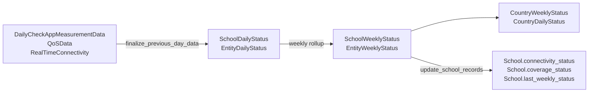

# Aggregation jobs

Turning raw measurements into the denormalised fields and rollup tables the map reads.

| Schedule (UTC) | Task | Limit |
|---|---|---|
| `01:00` | `schools.update_school_records` | 10 h |
| `01:30` | `utils.update_entity_records` | 10 h |
| `02:50, 08:50, 14:50, 20:50` | `utils.populate_school_registration_data` | 1 h |
| `02:55, 08:55, 14:55, 20:55` | `utils.populate_entity_registration_data` | 1 h |
| — (chained) | `data_sources.finalize_previous_day_data` | 1 h |
| — (chained) | `data_sources.finalize_previous_day_entity_data` | 1 h |

---

## The two shapes of aggregation

**Rollups** — raw measurements → daily → weekly rows. Driven by `finalize_previous_day_*`, invoked
from the live-data chain rather than scheduled directly
([ingestion-live-data.md](ingestion-live-data.md)).

**Denormalisation** — copying a computed value onto the `School` / `Entity` row so the map does not
have to join. Driven by `update_school_records` / `update_entity_records`.



## Weekly rows are ISO-week keyed

`SchoolWeeklyStatus` and `CountryWeeklyStatus` are keyed by `(year, week)` using **ISO weeks**, via
the `isoweek` package and helpers in [proco/utils/dates.py](../../proco/utils/dates.py).

> ISO week 1 is the week containing the first Thursday of January, so early-January dates can belong
> to week 52/53 of the **previous** year, and late-December dates to week 1 of the **next**. Any
> recovery command taking `-year` and `-week_no` must use the ISO pair, not the calendar year of
> the date you have in mind. Getting this wrong writes correct-looking data into the wrong bucket.

`School.last_weekly_status` is a denormalised FK to the most recent weekly row, with
`on_delete=SET_NULL`.

## `update_school_records` — 01:00

[proco/schools/tasks.py:142](../../proco/schools/tasks.py#L142). Recomputes the denormalised fields
on `School`:

| Field | Default |
|---|---|
| `connectivity_status` | `'unknown'` |
| `coverage_status` | `'unknown'` |
| `coverage_type` | `'unknown'` |

All three are `max_length=10` `CharField`s with a blank default — there is no `choices` constraint,
so an unexpected value written by a recovery script will persist silently.

Manual equivalent, with useful scoping:

```bash
pipenv run python manage.py populate_school_new_fields -country_id=5
pipenv run python manage.py populate_school_new_fields -start_school_id=1 -end_school_id=100000
```

The task version is `populate_school_new_fields_task(start_school_id, end_school_id, country_id,
school_ids=None)` ([proco/utils/tasks.py:439](../../proco/utils/tasks.py#L439)), 10-hour limit.

## `update_entity_records` — 01:30

[proco/utils/tasks.py:600](../../proco/utils/tasks.py#L600). Covered in
[entity-jobs.md](entity-jobs.md). Takes optional `start_time`/`end_time` for incremental runs —
use them rather than letting a full pass run against the 10-hour limit.

## Real-time registration — 4× daily

`populate_school_registration_data` ([proco/utils/tasks.py:300](../../proco/utils/tasks.py#L300))
and `populate_entity_registration_data` ([proco/utils/tasks.py:505](../../proco/utils/tasks.py#L505)).

Both answer the same question with raw SQL: *which schools/entities have daily-status rows with a
non-null `connectivity_speed` but no real-time registration row?* Those are newly-reporting
entities, and a registration row is created for each.

Both then derive `connectivity_status` from the latest daily speed and save it.

> Neither query has a time bound, despite log messages referring to "the last 6 hours". Every run
> scans all unregistered rows. On a large first import this is slow; in steady state the result set
> is small, so it rarely shows.

Manual:

```bash
pipenv run python manage.py populate_school_registration_data --reset -country_id=144
pipenv run python manage.py populate_entity_registration_data --reset -entity_id=123
```

## Country rollups

`CountryWeeklyStatus` ([proco/connection_statistics/models.py:58](../../proco/connection_statistics/models.py#L58))
carries the pie-chart counters the map draws:

| Group | Fields |
|---|---|
| Connectivity | `schools_connectivity_good/moderate/no/unknown` |
| Connectivity (global) | `global_schools_connectivity_good/moderate/no/unknown` |
| Coverage | `schools_coverage_good/moderate/no/unknown` |
| Totals | `schools_total`, `schools_connected`, `schools_with_data_percentage` |
| Quality | `connectivity_availability`, `coverage_availability`, `avg_distance_school` |
| Onboarding | `integration_status` |

The `global_*` variants hold the same counts computed against the **global** benchmark rather than
the country's own, so the UI can offer both without a second query.

`connectivity_availability` and `coverage_availability` describe *how good the underlying data is*,
not how good connectivity is:

| `CONNECTIVITY_TYPES_AVAILABILITY` | Meaning |
|---|---|
| `no_connectivity` | No data |
| `connectivity` | Availability information only |
| `static_speed` | Actual static speeds |
| `realtime_speed` | Actual real-time speeds |

> **`CountryWeeklyStatus` and `CountryDailyStatus` are shared between the school and entity
> pipelines.** There is no entity-specific country rollup. While both pipelines are active, country
> totals reflect whichever job wrote last. Treat country-level numbers with caution until the
> migration completes.

## Re-aggregation

```bash
# Schools
pipenv run python manage.py redo_aggregations \
  -country_id=5 -year=2026 -week_no=37 --update_school_weekly --update_country_daily

# Entities
pipenv run python manage.py redo_entity_aggregations \
  -country_id=5 -entity_type_code='health' -year=2026 -week_no=37 --update_entity_weekly
```

Both dispatch 10-hour Celery tasks: `redo_aggregations_task(country_id, year, week_no)`
([proco/utils/tasks.py:358](../../proco/utils/tasks.py#L358)) and
`redo_entity_aggregations_task(country_id, year, week_no, entity_type_code)`
([line 398](../../proco/utils/tasks.py#L398)).

Re-aggregation reads whatever raw data is still present. Given the retention windows
(QoS: latest version only; PCDC: 30 days), re-aggregating an old week may produce *worse* data than
what is already stored. Check what raw data survives before running it —
[../08-operations/runbooks.md](../08-operations/runbooks.md).

## Duplicate rows

Duplicated statistics rows produce totals that do not match the school list:

```bash
# Snapshot the database first — no dry-run flag exists
pipenv run python manage.py data_cleanup --clean_duplicate_school_weekly -country_id=5
pipenv run python manage.py data_cleanup --clean_duplicate_school_daily -country_id=5
pipenv run python manage.py data_cleanup --clean_duplicate_country_weekly -country_id=5
pipenv run python manage.py data_cleanup --clean_duplicate_country_daily -country_id=5
```

## Failure modes

| Symptom | Cause |
|---|---|
| Map colours stale, statistics current | `update_school_records` did not run — denormalised fields not refreshed |
| Pie chart ≠ school list | Duplicate weekly/daily rows |
| A week is empty | ISO-week boundary — check the adjacent year |
| New live-reporting schools show `unknown` | `populate_school_registration_data` skipped |
| Re-aggregation makes things worse | Raw data already pruned by the retention jobs |
