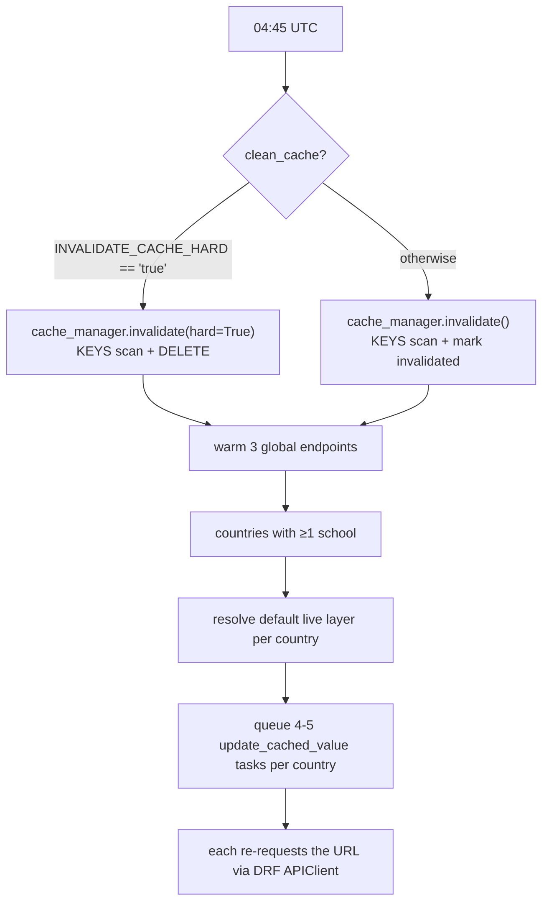

# Cache warming

One job, `update_all_entity_cached_values`, at **04:45 UTC** with `clean_cache=True`.

Its predecessor `update_all_cached_values` ([proco/utils/tasks.py:34](../../proco/utils/tasks.py#L34))
is commented out of the schedule but is the clearer implementation to read; the entity version at
[line 859](../../proco/utils/tasks.py#L859) follows the same shape.

---

## What it does



## Step 1 — invalidate

```python
if clean_cache:
    if settings.INVALIDATE_CACHE_HARD.lower() == 'true':
        cache_manager.invalidate(hard=True)
    else:
        cache_manager.invalidate()
```

`INVALIDATE_CACHE_HARD` is a **string**, compared with `.lower() == 'true'`. A Python boolean will
raise `AttributeError`.

| Mode | Effect | Between invalidation and warming |
|---|---|---|
| Soft (default) | Mark `invalidated=True` | Users get **stale** data, refreshes queue |
| Hard | `DELETE` the keys | Users get **cold misses** and wait |

> Both modes call `cache.keys(pattern)`, which is a Redis **`KEYS`** scan over the whole keyspace —
> a blocking O(N) operation. If Redis latency spikes at 04:45, this is the cause. Replacing it with
> `SCAN` would be a contained fix.

## Step 2 — global endpoints

```python
update_cached_value.delay(url=reverse('locations:search-countries-admin-schools'))
update_cached_value.delay(url=reverse('locations:countries-list'))
update_cached_value.delay(url=reverse('connection_statistics:global-stat'))
```

These three are what the map landing page requests first.

## Step 3 — per-country

Countries are selected by having **at least one school**:

```python
countries = Country.objects.filter(id__in=list(
    School.objects.all().values_list('country_id', flat=True)
        .order_by('country_id').distinct('country_id')
))
```

> This is the **school** table, even in `update_all_entity_cached_values`. A country with health
> entities but no schools would not be warmed. Worth checking once the entity frontend ships.

Per country, three tasks are always queued:

```python
update_cached_value.s(url=reverse('locations:countries-detail', kwargs={'pk': country.code.lower()}))
update_cached_value.s(url=reverse('connection_statistics:global-stat'),
                      query_params={'country_id': country.id})
update_cached_value.s(url=reverse('accounts:list-published-advance-filters',
                                  kwargs={'status': 'PUBLISHED', 'country_id': country.id}),
                      query_params={'expand': 'column_configuration', 'ordering': 'name'})
```

> **Query parameters are part of the cache key.** The advanced-filters entry is warmed with exactly
> `expand=column_configuration&ordering=name`. A frontend request with a different `expand`, a
> different `ordering`, or an extra parameter is a **complete miss**. If you change a query string
> on the frontend, change it here too.

## Step 4 — the default data layer

A fourth task is added only when the country has a default live layer:

```python
country_wise_default_layers = {
    row['country_id']: row['data_layer_id']
    for row in DataLayerCountryRelationship.objects.filter(
        Q(is_default=True) | Q(
            is_default=False,
            data_layer__category=DataLayer.LAYER_CATEGORY_CONNECTIVITY,
            data_layer__created_by__isnull=True,
        ),
        data_layer__type=DataLayer.LAYER_TYPE_LIVE,
        data_layer__status=DataLayer.LAYER_STATUS_PUBLISHED,
        data_layer__deleted__isnull=True,
        country_id__in=list(countries),
    ).values('country_id', 'data_layer_id').order_by('country_id').distinct()
}
```

Warmed layers are: the country default, **plus** every system-created
(`created_by__isnull=True`) published live connectivity layer.

> An **admin-created layer is not warmed** unless it is also the country default. It will be
> consistently slower than a system layer, and nothing in the admin UI says so.

The task then makes a **synchronous `APIClient` call** to `get-latest-week-and-month` with
`cache=False` to discover the current week, and warms the layer's `info` endpoint for that window:

```python
query_params={
    'country_id': country.id,
    'start_date': latest_week_start_str,
    'end_date': latest_week_end_str,
    'is_weekly': 'true',
    'benchmark': 'global',
    'include_same_location_schools': 'false',
    ...
}
```

> That synchronous call happens **inside the loop, once per country**. With ~150 countries that is
> 150 sequential in-process HTTP round trips through the full DRF stack before the warming tasks are
> even queued, and they run with `cache=False` so each hits the database. This is the slowest part
> of the job and the most likely reason it approaches its 2-hour limit.

`LIVE_LAYER_CACHE_FOR_COUNTRY_IDS` (default **`['144']`** — a single country) and `LIVE_LAYER_CACHE_FOR_WEEKS` (default **5**) bound this work.

> Both defaults are narrow. `LIVE_LAYER_CACHE_FOR_COUNTRY_IDS` defaults to country id `144` only,
> not to "all countries" — so on an unconfigured environment live-layer warming covers **one
> country**. Neither variable is in `.env_example`'s live-layer section with a meaningful value
> (`LIVE_LAYER_CACHE_FOR_COUNTRY_IDS=` is present but empty, which `env.list` reads as `['']`).

## `update_cached_value`

[proco/utils/tasks.py:24](../../proco/utils/tasks.py#L24), 10-minute limit. Takes a `url` and
optional `query_params`, issues the request through DRF's `APIClient`, and the view's own caching
stores the result. The cache is therefore always populated by the real view — warm and cold
responses cannot diverge.

This is also the task queued by `SoftCacheManager.get` when it serves a stale value, which is why
the stored entry must carry `request_path`. An entry set without one is never refreshed.

## Failure modes

| Symptom | Cause |
|---|---|
| Everything slow after 04:45 | Hard invalidation ran and warming has not finished |
| Redis latency spike at 04:45 | The `KEYS` scan |
| One country slow | No default live layer, so the layer `info` endpoint was never warmed |
| One layer slow | Admin-created and not the country default — outside the warm filter |
| A whole endpoint always cold | Frontend query string does not match the warmer's |
| Job hits its 2-hour limit | The per-country synchronous `APIClient` calls |

## Manual warming

```bash
# Warm without clearing
pipenv run python manage.py shell -c "
from proco.utils.tasks import update_all_entity_cached_values
update_all_entity_cached_values.delay(clean_cache=False)"

# One URL
pipenv run python manage.py shell -c "
from proco.utils.tasks import update_cached_value
update_cached_value.delay(url='/api/statistics/global-stat/', query_params={'country_id': 5})"
```

## Related

- [../08-operations/caching-and-performance.md](../08-operations/caching-and-performance.md)
- [../04-admin-flows/cache-invalidation.md](../04-admin-flows/cache-invalidation.md)
