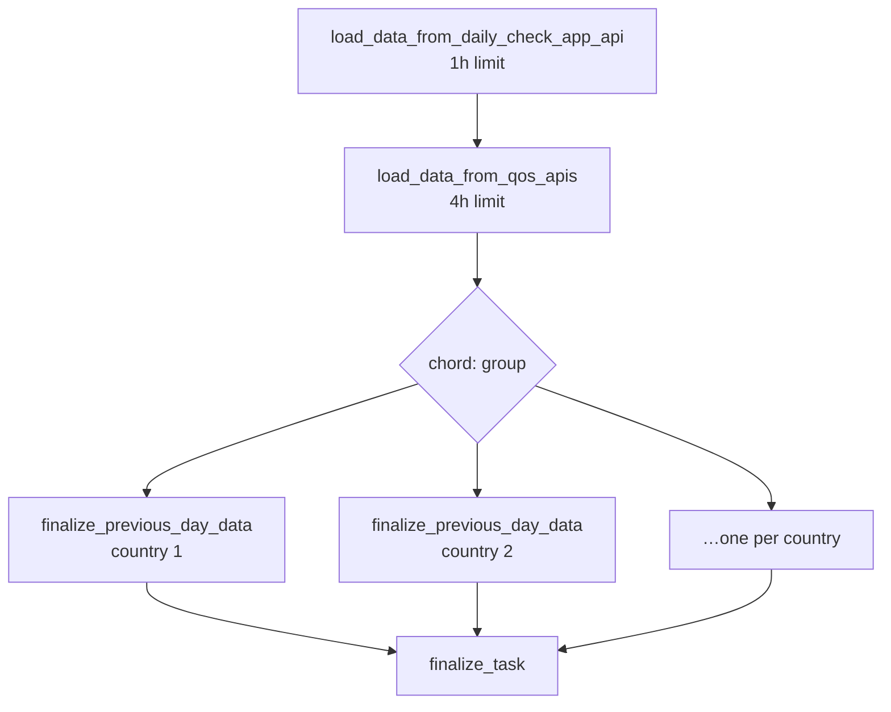

# Live data ingestion

Real-time connectivity measurements from the Daily Check App (PCDC/MLab) and from QoS partners.

**Jobs covered**

| Schedule (UTC) | Task | `today` |
|---|---|---|
| `02:10, 08:10, 14:10, 20:10` | `update_live_data` | `True` |
| `00:30` | `update_live_data` | `False` |
| `04:00` | `update_qos_data` | `False` |
| `05:00` | `update_entity_qos_data` | `False` |
| `10:30, 16:30, 22:30` | `update_entity_live_data_from_giga_meter` | — |

---

## Two sources, one pipeline

| Source | Transport | Lands in | `live_data_source` |
|---|---|---|---|
| Daily Check App / MLab | REST API | `DailyCheckAppMeasurementData` | `DAILY_CHECK_APP_MLAB` |
| QoS | Databricks Delta Share, schema `qos` | `QoSData` | `QOS` |

Both are then aggregated into `RealTimeConnectivity` and rolled up into the daily/weekly tables. A
school with both sources is tagged `DAILY_CHECK_APP_MLAB_QOS`
([proco/connection_statistics/config.py:3](../../proco/connection_statistics/config.py#L3)).

## The Celery workflow

`update_live_data` ([proco/data_sources/tasks.py:1004](../../proco/data_sources/tasks.py#L1004))
builds a chain/chord rather than doing the work inline:

```python
chain(
    load_data_from_daily_check_app_api.s(),
    load_data_from_qos_apis.s(),
    chord(
        group([
            finalize_previous_day_data.s(country_id, target_date)
            for country_id in countries_ids
        ]),
        finalize_task.si(),
    ),
).delay()
```



Three things follow from this shape:

1. **The parent task finishes immediately.** `update_live_data` calls `.delay()` on the chain and
   then marks its own `BackgroundTask` complete. The `BackgroundTask` row says "completed" while
   the actual ingestion has barely started — it is **not** a progress indicator for this job.
2. **The fan-out is one task per country.** `countries_ids = Country.objects.values_list('id',
   flat=True)` — *every* country, including those with no schools and no live data. With ~200
   countries that is 200 queued tasks per run, four to five times a day, most of which do nothing.
   `update_qos_data` is smarter, deriving its country list from `QoSData` itself.
3. **A failure in the chain stops everything downstream.** If `load_data_from_qos_apis` raises, the
   chord never runs and no country gets finalised — including the Daily Check App data that loaded
   successfully in step one.

> **Operational note (not yet verified from code).** This is not theoretical — it is the routine failure
> mode in practice. QoS is the historically unstable source (see `504 Gateway Time-out` on
> `io-datasharing-stg.unitst.org` in the incident doc below); Giga Meter has been stable for about a
> year. When the QoS leg fails, Giga Meter's data has already landed correctly in
> `DailyCheckAppMeasurementData` / `RealTimeConnectivity`, but the chord (and therefore all
> aggregation) never runs — so Giga Meter also ends up with no daily/weekly rollup for that cycle,
> even though nothing is wrong with its own data. The workaround used so far has been to manually
> re-trigger `finalize_previous_day_data` for the affected countries once QoS is unblocked (see
> [aggregation.md](aggregation.md) / [../08-operations/runbooks.md](../08-operations/runbooks.md)).
> The proposed structural fix — not yet implemented — is to split this into two independent
> aggregation chains, one per source, so a QoS outage no longer blocks Giga Meter rollups.

## `today` vs yesterday

The same task serves two purposes:

| Invocation | `today` | Aggregation target |
|---|---|---|
| `02:10, 08:10, 14:10, 20:10` | `True` | Today — a rolling intraday refresh |
| `00:30` | `False` | Yesterday — the authoritative daily close |

The `00:30` run exists to close out the previous day once all measurements have arrived. The
`task_key` includes `today`, so the two variants never block each other.

The QoS equivalents run with `today=False` only — `04:00` for schools, `05:00` for entities. There
is no intraday QoS refresh.

## Daily Check App

`load_data_from_daily_check_app_api`
([proco/data_sources/tasks.py:799](../../proco/data_sources/tasks.py#L799)), 1-hour limit.

Configuration under `DATA_SOURCE_CONFIG['DAILY_CHECK_APP']`:

| Setting | Default |
|---|---|
| `BASE_URL` | `None` |
| `API_CODE` | `DAILY_CHECK_APP` |
| `MEASUREMENT_PATH` | `/measurements/v2/sandbox` |
| `PAGE_SIZE` | `50` |

> The default measurement path is **`/measurements/v2/sandbox`** — a sandbox endpoint. Any
> environment that has not overridden `ENTITY_GIGA_METER_MEASUREMENT_PATH` is reading test data.
> Check this before investigating "wrong measurements in production".
>
> A page size of 50 is also small for a bulk pull; the pagination cost dominates on high-volume
> days.

Authentication uses an API key issued through the normal API-key machinery with
`has_write_access=True` — see the `create_api_key_with_write_access` examples in
[web-worker.sh](../../web-worker.sh).

## QoS

`load_data_from_qos_apis` ([proco/data_sources/tasks.py:806](../../proco/data_sources/tasks.py#L806)),
4-hour limit. Reads the `qos` schema from the Delta Share, one table per country, honouring
`QOS_COUNTRY_EXCLUSION_LIST`. Same profile-file mechanism as master data — see
[ingestion-master-data.md](ingestion-master-data.md#credentials-are-written-to-disk-then-deleted).

`QoSData` ([proco/data_sources/models.py:247](../../proco/data_sources/models.py#L247)) carries the
richer telemetry: `connectivity_latency`, `jitter_download`, `jitter_upload`,
`rtt_packet_loss_pct`, `uptime`, `roundtrip_time`, plus `speed_probe` and `speed_mean` variants.

The entity version reads `QOS_ENTITY_SCHEMA_NAME`, which defaults to **`health-master`** rather
than a QoS-specific schema — worth verifying against the actual data platform layout.

## Aggregation

`finalize_previous_day_data(country_id, date)`
([proco/data_sources/tasks.py:976](../../proco/data_sources/tasks.py#L976)) and its entity twin
`finalize_previous_day_entity_data(country_id, date, entity_type_code)` roll raw measurements into
`SchoolDailyStatus` / `EntityDailyStatus` and update the weekly tables. Both have a 1-hour limit.

Details in [aggregation.md](aggregation.md).

## Retention

`clean_old_live_data`, daily at **05:10 UTC**
([proco/data_sources/tasks.py:1099](../../proco/data_sources/tasks.py#L1099)):

| Table | Rule |
|---|---|
| `RealTimeConnectivity` | Delete where `created < now - 30 days` |
| `DailyCheckAppMeasurementData` | Delete where `created_at < now - 30 days` |
| `QoSData` | **Keep only the latest `version` per country** — delete everything else |
| `EntityRealTimeConnectivity` | Keep only the max `version` per country |

> The `QoSData` rule is **not** a 30-day window despite living in a task called
> `clean_old_live_data`. It keeps exactly one row per country — the highest `version` — and deletes
> the rest unconditionally, including rows loaded minutes earlier with a lower version number.
>
> Any analysis that needs QoS history must read `SchoolDailyStatus` / `EntityDailyStatus`, not
> `QoSData`. And any recovery job that needs to re-derive from raw QoS rows has a **one-day
> window at most** before 05:10 removes them.

`clean_historic_data`, **Saturdays and Sundays at 05:20**
([proco/data_sources/tasks.py:1255](../../proco/data_sources/tasks.py#L1255)) prunes
`django-simple-history` rows by delegating to a management command:

```python
call_command('data_source_additional_steps', '--clean_school_master_historical_rows')
call_command('data_source_additional_steps', '--clean_health_entity_master_historical_rows')
```

`day_of_week='0,6'` is Sunday and Saturday in Celery's convention.

## Manual invocation

```bash
curl "https://<host>/api/sources/load/daily_check_app/"
curl "https://<host>/api/sources/load/qos/"
curl "https://<host>/api/sources/load/static_live/"
```

## Failure modes

| Symptom | Cause | Check |
|---|---|---|
| `BackgroundTask` says completed but no data | Expected — the task only queues the chain | Flower, or the child tasks' own `BackgroundTask` rows |
| No live data at all after a run | Chain broke at `load_data_from_qos_apis` | Worker logs for that task |
| Measurements look like test data | `MEASUREMENT_PATH` still the sandbox default | `ENTITY_GIGA_METER_MEASUREMENT_PATH` |
| One country missing | ISO3 in `QOS_COUNTRY_EXCLUSION_LIST` | Settings |
| QoS history gone | By design — `clean_old_live_data` keeps one version per country | `SchoolDailyStatus` instead |
| Yesterday never closed | The `00:30` run was skipped by the `BackgroundTask` guard | `update_live_data_status_*_False` rows |
| Giga Meter data loaded but no daily/weekly rollup | QoS leg of the chain failed upstream of the chord, so `finalize_previous_day_data` never ran for either source | Worker logs around `load_data_from_qos_apis`; manually rerun aggregation for the affected countries/date |

## Recovery

- `data_loss_recovery_for_pcdc`, `data_loss_recovery_for_pcdc_weekly`
- `data_loss_recovery_for_qos`, `data_loss_recovery_for_qos_dates`
- `redo_aggregations`, `redo_entity_aggregations`

All in [../08-operations/runbooks.md](../08-operations/runbooks.md).
