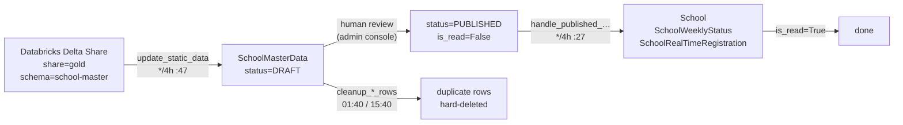

# Master-data ingestion

How authoritative school and health-facility data gets from Giga's data platform into the
application database, via a human review gate.

**Jobs covered**

| Schedule (UTC) | Task |
|---|---|
| `*/4h :47` | `update_static_data` → `load_data_from_school_master_apis` |
| `*/4h :52` | `update_entity_static_data` |
| `*/4h :27` | `handle_published_school_master_data_row` |
| `*/4h :32` | `handle_published_entity_master_data_row` |
| `*/4h :17` | `handle_deleted_school_master_data_row` |
| `*/4h :22` | `handle_deleted_entity_master_data_row` |
| `01:40, 15:40` | `cleanup_school_master_rows` |
| `01:45, 15:45` | `cleanup_health_entity_master_rows` |

---

## The pipeline



The key design decision: **ingestion never writes directly to `School`.** It writes to a staging
table whose rows carry a review status, and a *separate* job applies published rows to the real
models. This means a bad upstream release cannot corrupt the live map without a human in the loop —
but it also means a two-step latency of up to 4 hours between publish and visibility.

---

## Step 1 — Pull from Delta Share

`load_data_from_school_master_apis`
([proco/data_sources/tasks.py:107](../../proco/data_sources/tasks.py#L107)), invoked by the
scheduled `update_static_data` wrapper.

### Credentials are written to disk, then deleted

```python
profile_json = {
    'shareCredentialsVersion': ds_settings.get('SHARE_CREDENTIALS_VERSION', 1),
    'endpoint': ds_settings.get('ENDPOINT'),
    'bearerToken': ds_settings.get('BEARER_TOKEN'),
    'expirationTime': ds_settings.get('EXPIRATION_TIME'),
}
profile_file = os.path.join(settings.BASE_DIR, 'school_master_profile_{dt}.share'.format(...))
open(profile_file, 'w').write(json.dumps(profile_json))
```

The `delta-sharing` client requires a profile *file*, so the bearer token is written to
`BASE_DIR` — the application root — and removed in a `try/except OSError: pass` at the end.

> **Operational risk.** If the task is killed between writing and removing the profile, a file
> containing a live bearer token is left in the application directory. The filename is
> timestamped, so repeated failures accumulate files. Worth a periodic
> `ls $BASE_DIR/*_profile_*.share` check on any host that has seen worker crashes.

### One table per country

The share exposes one table per country, named by ISO3 code. The task iterates
`client.list_tables(schema)` and for each:

1. Skips it if `country_iso3_format` was passed and does not match (the single-country path).
2. Skips it if the code appears in `SCHOOL_MASTER_COUNTRY_EXCLUSION_LIST`.
3. Calls `sync_school_master_data(...)`, accumulating into `changes_for_countries` and
   `deleted_schools`.

Health Master additionally honours `HEALTH_MASTER_COUNTRY_INCLUSION_LIST` — an allow-list. Health
ingestion is opt-in per country; school ingestion is opt-out.

### Failures are per-country and non-fatal

```python
except (HTTPError, DataError, ValueError) as ex:
    logger.warning('Exception caught for "{0}": {1}'.format(schema_table.name, str(ex)))
except Exception as ex:
    logger.warning('Exception caught for "{0}": {1}'.format(schema_table.name, str(ex)))
```

Both branches do the same thing. One country failing does not stop the others — good — but the
failure is logged at **warning** level and the task still reports success. A country can silently
stop updating for weeks.

> **If a country's data looks stale, check worker logs for
> `Exception caught for "<ISO3>"` before assuming the upstream share is at fault.**
> There is no metric or alert on this path.

Note also that the `errors` list built at the top of the function is **never appended to** — the
error-summary section of the notification email is therefore always empty, even though the code to
format it exists.

### Notification on change

If anything changed, or any school was deleted, the task emails everyone holding
`CAN_UPDATE_SCHOOL_MASTER_DATA` or `CAN_PUBLISH_SCHOOL_MASTER_DATA`, with a deep link to
`SCHOOL_MASTER_DASHBOARD_URL`, and fires a Slack notification per affected country via
`send_school_master_data_change_slack_notification.delay(...)`.

---

## Step 2 — Human review

Rows land as `DRAFT` and move through an eight-state machine before they affect anything. This is
an admin flow, documented in full at
[../04-admin-flows/school-master-review-publish.md](../04-admin-flows/school-master-review-publish.md).

The states are defined on `MasterDataSourceModelMixin`
([proco/core/models.py:194](../../proco/core/models.py#L194)) and shared by both `SchoolMasterData`
and `HealthEntityMasterIntermediateData`.

## Step 3 — Apply published rows

`handle_published_school_master_data_row`
([proco/data_sources/tasks.py:251](../../proco/data_sources/tasks.py#L251)).

Selects the work:

```python
new_published_records = SchoolMasterData.objects.filter(
    status=ROW_STATUS_PUBLISHED, is_read=False,
).select_related('country', 'school', 'school__admin1', 'school__admin2',
                 'school__last_weekly_status')
```

`is_read` is the idempotency flag: set to `True` once a row has been applied, so re-running the job
is safe.

Then, in chunks of 100 via `queryset_iterator`:

- Normalises `school_area_type` through a small map — `{'urban': 'urban', 'urbana': 'urban',
  'rural': 'rural'}`. Note `'urbana'` (Portuguese/Spanish) is handled but there is no `'rural'`
  equivalent variant; anything unrecognised becomes `''`.
- Resolves `admin1_id_giga` / `admin2_id_giga` to `CountryAdminMetadata` rows — **two extra queries
  per row**, not batched. On a large country this dominates runtime.
- `School.objects.update_or_create(...)` on the school itself.
- Writes the corresponding `SchoolWeeklyStatus` and `SchoolRealTimeRegistration` rows.
- Builds `change_summary` per country for the Slack notification: new / updated / deleted counts
  plus per-field change counts across three model groups.

### `publish_source`

The task takes a `publish_source` argument that records *how* the publish was triggered:

| Value | Set by |
|---|---|
| `auto_publish` | The scheduled run (default) |
| `cli` | `GET /api/sources/load/school_master/` |
| `admin_portal_selected` | Publishing individual rows in the admin console |
| `admin_portal_country` | Publishing a whole country in the admin console |

### Task keys vary by invocation

The `BackgroundTask` name is built differently depending on arguments — global, per-country, or
per-row — all bucketed to the **hour** (`%d%m%Y_%H`). Two per-country publishes for *different*
countries in the same hour get different keys and both run; two publishes for the *same* country in
the same hour, the second silently no-ops.

## Step 4 — Apply deletions

`handle_deleted_school_master_data_row`
([proco/data_sources/tasks.py:571](../../proco/data_sources/tasks.py#L571)) handles rows that
upstream marked as removed, soft-deleting the `School` (which cascades the soft delete to its daily
and weekly statuses — [proco/schools/models.py:110](../../proco/schools/models.py#L110)).

It runs at `:17`, **ten minutes before** the publish handler at `:27`. Deletions are applied before
creations within each 4-hour cycle.

## Step 5 — Cleanup

`cleanup_school_master_rows`
([proco/data_sources/tasks.py:822](../../proco/data_sources/tasks.py#L822)) runs twice a day and
collapses the staging table, per country, with three raw-SQL passes:

| Pass | Partition | Keeps | Applies to |
|---|---|---|---|
| 1 | `school_id_giga` | newest by `created` | `DRAFT`, `UPDATED_IN_DRAFT`, `DRAFT_LOCKED`, `UPDATED_IN_DRAFT_LOCKED`, `DELETED`, `DELETED_PUBLISHED`, `DISCARDED` |
| 2 | `school_id_giga` | newest by `published_at` | `PUBLISHED` |
| 3 | `school_id_giga` | newest by `created` | `is_read=True AND status != 'PUBLISHED'` |

> **These are hard `DELETE` statements, not soft deletes.** They bypass the ORM, the soft-delete
> convention and `django-simple-history`. Superseded review rows are gone permanently. If you need
> an audit trail of what a reviewer saw before publishing, the `HistoricalRecords` table is the
> only copy, and it is not what this job prunes.

`cleanup_health_entity_master_rows` does the same for the health staging table.

---

## Manual invocation

```bash
# Whole pipeline, all countries
curl "https://<host>/api/sources/load/school_master/"

# One country, from a shell
pipenv run python manage.py shell -c "
from proco.data_sources.tasks import update_static_data
update_static_data.delay(country_iso3_format='BRA')"
```

The HTTP endpoint runs `handle_published_…` and `handle_deleted_…` **synchronously** (not
`.delay()`) with `publish_source='cli'` — see
[proco/data_sources/api.py:51](../../proco/data_sources/api.py#L51). On a large dataset this will
exceed the gunicorn 300-second timeout; the work continues in the worker process but the caller
gets a 504.

## Failure modes

| Symptom | Likely cause | Where to look |
|---|---|---|
| One country stale, others fine | Per-country exception swallowed as a warning | Worker logs, `Exception caught for "<ISO3>"` |
| All countries stale | Share unreachable, or token expired | `Failed to get School Master share` in logs; check `SCHOOL_MASTER_BEARER_TOKEN` / `EXPIRATION_TIME` |
| Rows published but map unchanged | `handle_published_…` skipped by the `BackgroundTask` guard, or still `is_read=False` | `BackgroundTask` table; count `SchoolMasterData` where `status='PUBLISHED' AND is_read=False` |
| Staging table growing unboundedly | `cleanup_school_master_rows` skipped | `BackgroundTask` rows named `cleanup_school_master_rows_status_*` |
| `.share` files in `BASE_DIR` | Worker killed mid-pull | Delete them; they contain live tokens |
| Country silently excluded | ISO3 in `*_COUNTRY_EXCLUSION_LIST`, or missing from `HEALTH_MASTER_COUNTRY_INCLUSION_LIST` | Settings; the log line names the country |

## Recovery

See [../08-operations/runbooks.md](../08-operations/runbooks.md) — in particular
`data_loss_recovery_for_school_master_version` for replaying a specific upstream version.
