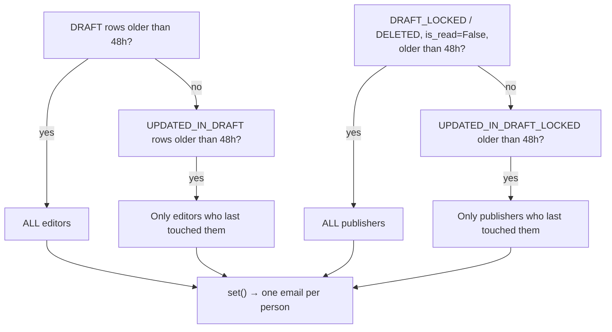

# Notification jobs

| Schedule (UTC) | Task | Limit |
|---|---|---|
| `08:10` | `email_reminder_to_editor_and_publisher_for_review_waiting_records` | **none declared** |
| on change | `send_school_master_data_change_slack_notification` | per-country |
| on demand | `mailing.send_email` | none declared |

---

## Review reminders — 08:10 daily

[proco/data_sources/tasks.py:659](../../proco/data_sources/tasks.py#L659). Nags editors and
publishers about master-data rows older than `SCHOOL_MASTER_REVIEW_GRACE_PERIOD_IN_HRS`
(default 48).

### Targeting is selective, not a broadcast



Recipients are resolved by permission slug via `get_user_emails_for_permissions`, optionally
filtered to specific user ids (`ids_to_filter`) for the "only those who touched it" branches. The
final list is de-duplicated with `set()` so nobody gets two emails.

### Two silent short-circuits

```python
if not settings.ENABLED_DATA_SOURCES_EMAILS:
    task_instance.info('ERROR: School Master data source email notification is disabled.')
elif is_blank_string(settings.ANYMAIL.get('MAILJET_API_KEY')) or \
     is_blank_string(settings.ANYMAIL.get('MAILJET_SECRET_KEY')):
    task_instance.info('ERROR: MailJet creds are not configured ...')
```

Both write the reason into `BackgroundTask.log`, which makes this the **one notification path where
the admin console tells you why nothing was sent**. Check
`/admin/background-task` before anything else.

### No time limit

> The task declares no `soft_time_limit` or `time_limit`, so it inherits the worker CLI default of
> **60 s soft / 300 s hard** ([celery.sh](../../celery.sh)). It runs four queries over the staging
> table and then sends one email per unique recipient, synchronously.
>
> On a large backlog with many reviewers it can be killed mid-send — **some reviewers notified,
> others not, with no retry and no record of which**. Adding explicit limits, or dispatching each
> send through `mailing.send_email`, would fix this.

### The grace period only affects reminders

`SCHOOL_MASTER_REVIEW_GRACE_PERIOD_IN_HRS` governs nagging. **Nothing auto-publishes.** A row can
sit in `DRAFT` indefinitely; the system will keep emailing about it daily.

## Slack data-change alerts

`send_school_master_data_change_slack_notification`
([proco/data_sources/tasks.py:1888](../../proco/data_sources/tasks.py#L1888)), dispatched once per
changed country at the end of each master-data pull:

```python
for country_iso3_format, _ in changes_for_countries.items():
    send_school_master_data_change_slack_notification.delay(country_iso3_format)
```

> **One task per changed country, per ingestion run, every four hours.** A large upstream release
> produces a burst of tasks and a burst of Slack messages. There is no batching or digest.

Unlike email, Slack send failures are **logged and re-raised**
([proco/utils/slack_notification_service.py:27](../../proco/utils/slack_notification_service.py#L27)),
so they reach Sentry. If the webhook is unset the service logs at INFO and returns.

Message contents, headers by publish source, and the environment tag are documented in
[../06-integrations/email-and-slack.md](../06-integrations/email-and-slack.md#slack).

## Change-notification emails

Not a scheduled job — sent inline at the end of `load_data_from_school_master_apis`
([proco/data_sources/tasks.py:196](../../proco/data_sources/tasks.py#L196)) when anything changed or
any school was deleted. Recipients are everyone holding `CAN_UPDATE_SCHOOL_MASTER_DATA` or
`CAN_PUBLISH_SCHOOL_MASTER_DATA`.

The message includes the deleted-school list (full up to 5, a count beyond that) and a deep link to
`SCHOOL_MASTER_DASHBOARD_URL`.

> It also has an error-summary section built from an `errors` list that is **never appended to** —
> so that section is always empty, even when countries failed during the pull. The actual failures
> are only in the worker logs as `Exception caught for "<ISO3>"`.

## `mailing.send_email`

[proco/mailing/tasks.py:5](../../proco/mailing/tasks.py#L5) — the entire `mailing` app is 21 lines:

```python
@app.task(ignore_result=True)
def send_email(backend, *args, **kwargs):
    ...
```

Used when `MAILING_USE_CELERY` is enabled; otherwise sends are inline. `ignore_result=True` means no
result is stored — fire and forget. No declared time limits, which is fine per message.

## Kill switches

| Flag | Default | Gates |
|---|---|---|
| `ENABLED_DATA_SOURCES_EMAILS` | — | Review reminders, change notifications |
| `ENABLED_API_KEY_EMAILS` | `True` | API key lifecycle |
| `ENABLED_DATA_LAYER_EMAILS` | — | Layer publish |
| `MAILING_USE_CELERY` | — | Async vs inline sending |

Turn these off in any environment sharing a mail provider with production.

## Related

- [../06-integrations/email-and-slack.md](../06-integrations/email-and-slack.md)
- [../04-admin-flows/school-master-review-publish.md](../04-admin-flows/school-master-review-publish.md)
