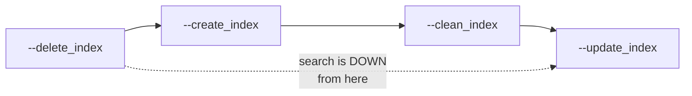

# Search index

Azure Cognitive Search backs country, school and entity search.

| Schedule (UTC) | Task | Limit |
|---|---|---|
| `02:00` | `utils.rebuild_unified_index` | 4 h |
| *(disabled)* | `utils.rebuild_school_index` | 4 h |

---

## Indexes

[config/settings/base.py:417](../../config/settings/base.py#L417):

| Index | Env var | Code default | Built by |
|---|---|---|---|
| Countries | `COUNTRY_INDEX_NAME` | `giga_countries` | — |
| Schools | `SCHOOL_INDEX_NAME` | `giga_schools` | `rebuild_school_index` *(disabled)* |
| Entities | `ENTITIES_INDEX_NAME` | `giga_entities` | `rebuild_unified_index` |

Client: `azure-search-documents` 11.3.0. Credentials from `SEARCH_ENDPOINT` and `SEARCH_API_KEY`,
gated by the module-level constant `ENABLE_AZURE_COGNITIVE_SEARCH = True` — hard-coded, not an
environment variable.

> **Naming mismatch.** Code defaults use underscores (`giga_schools`); `.env_example` supplies
> hyphens (`giga-schools`, `giga-countries`). Whichever the real service uses, code and environment
> must agree — a mismatch produces an empty search with no error and no log line.
>
> `ENTITIES_INDEX_NAME` is **absent from `.env_example`** entirely.

## `rebuild_unified_index` — 02:00

[proco/utils/tasks.py:481](../../proco/utils/tasks.py#L481). A thin wrapper:

```python
cmd_args = ['--delete_index', '--create_index', '--clean_index', '--update_index']
call_command('build_unified_index', *cmd_args)
```

**This is a full destructive rebuild, nightly.** The index is deleted, recreated, cleaned and
repopulated — not incrementally updated.



> **Search is unavailable for the duration of the rebuild.** Between `--delete_index` and the end of
> `--update_index` the index does not exist or is partially populated, so queries return nothing.
> On a large dataset this window can be substantial — the task allows up to 4 hours.
>
> If the task fails partway, **the index stays deleted or partial until the next night's run**.
> There is no retry and no alert. Verify after any failure:
>
> ```bash
> pipenv run python manage.py shell -c "
> from proco.background.models import BackgroundTask
> print(list(BackgroundTask.objects.filter(
>     name__startswith='rebuild_unified_index'
> ).order_by('-created_at').values_list('created_at','completed_at','status')[:5]))"
> ```
>
> Running it at 02:00 UTC places the outage in low-traffic hours for most of the world, which is
> presumably the intent. An index-swap approach (build into a new index, then repoint) would remove
> the window entirely.

## The commands

```bash
# Full rebuild
pipenv run python manage.py build_unified_index \
  --delete_index --create_index --clean_index --update_index

# Incremental update only — no outage
pipenv run python manage.py build_unified_index --update_index

# Scoped
pipenv run python manage.py build_unified_index --update_index -country_id=144
pipenv run python manage.py build_unified_index --update_index -entity_id=123
pipenv run python manage.py build_unified_index --update_index -school_id=456
```

| Flag | Effect |
|---|---|
| `--delete_index` | Drop the index |
| `--create_index` | Create it with the schema |
| `--clean_index` | Clear documents |
| `--update_index` | Populate from the database |
| `-country_id`, `-school_id`, `-entity_id` | Scope the update |

`index_rebuild_schools` is the legacy equivalent targeting `giga_schools`; it accepts the same flags
minus `-entity_id`.

> **Prefer `--update_index` alone for recovery.** It refreshes documents without deleting the index,
> so search stays up. The full four-flag sequence is only needed when the index *schema* has changed.

## Search endpoints

| Endpoint | Purpose |
|---|---|
| `GET /api/locations/gsearch/` | Global search |
| `GET /api/locations/search-countries/` | Country search with statistics |
| `GET /api/v2/entities/gentity-search/` | Entity search |

Implementation: `BaseSearchMixin` ([proco/locations/api.py:530](../../proco/locations/api.py#L530))
and `AggregateSearchViewSet` ([line 735](../../proco/locations/api.py#L735)), with the entity
variant in [proco/entities/api.py](../../proco/entities/api.py).

`search-countries-admin-schools` and `search-countries-admin-entities` are both on the read-replica
whitelist and are warmed nightly.

## Failure modes

| Symptom | Cause | Check |
|---|---|---|
| Search returns nothing, everything else fine | Index name mismatch (hyphen vs underscore) | `SEARCH_*` and `*_INDEX_NAME` vars |
| Search worked yesterday, empty today | Rebuild failed after `--delete_index` | `BackgroundTask` rows for `rebuild_unified_index_status_*` |
| Search empty for a few hours nightly | Expected — the rebuild window | — |
| New schools not searchable | Index only refreshes nightly | `build_unified_index --update_index -country_id=…` |
| Entities missing but schools present | `ENTITIES_INDEX_NAME` unset | Settings |

## Recovery

```bash
# Least disruptive: refresh documents, keep the index
pipenv run python manage.py build_unified_index --update_index

# If the index itself is gone
pipenv run python manage.py build_unified_index --create_index --update_index
```
