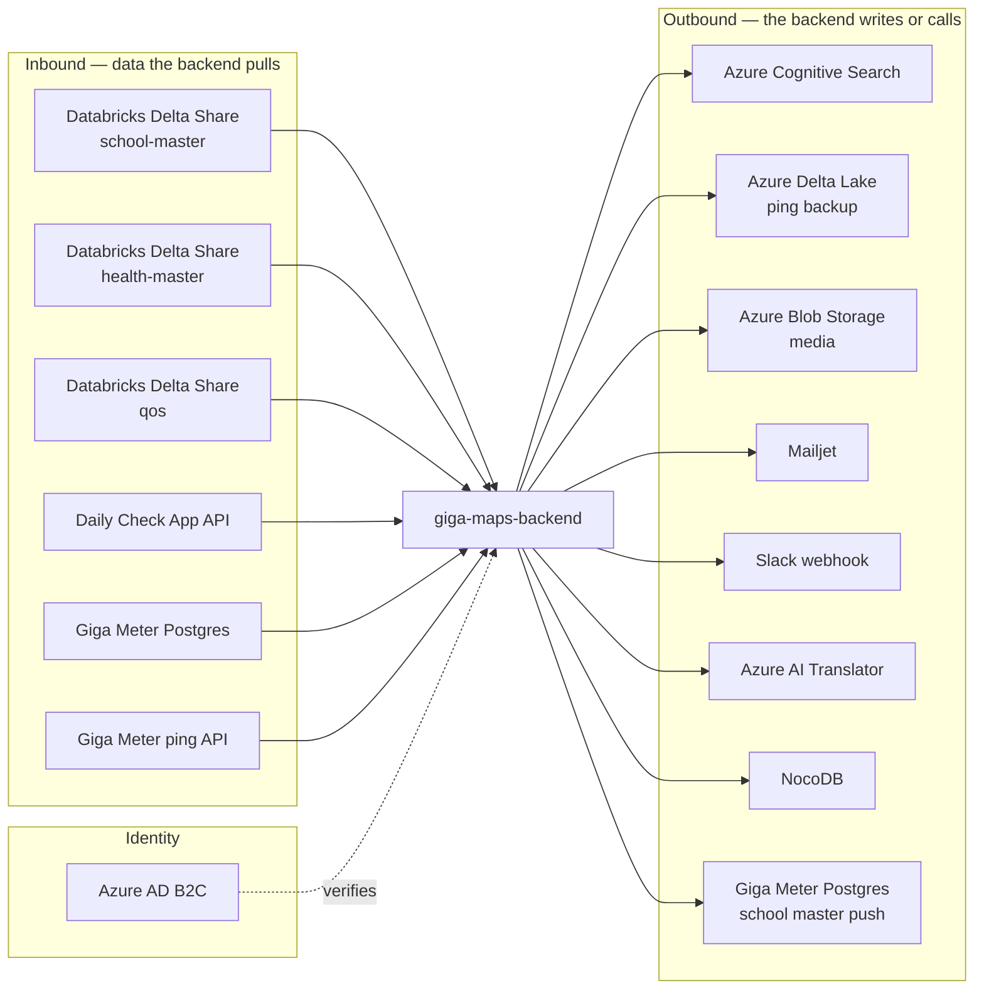

# External integrations

Every system this backend talks to, what it is used for, and how it fails.



---

## At a glance

| System | Direction | Protocol | Configured by | Failure mode |
|---|---|---|---|---|
| [Delta Sharing](delta-sharing.md) | In | `delta-sharing` client | `DATA_SOURCE_CONFIG` | Per-country warning, silent gap |
| [Daily Check App](daily-check-app.md) | In | REST + API key | `DATA_SOURCE_CONFIG['DAILY_CHECK_APP']` | Chain aborts, no live data |
| [Giga Meter DB](giga-meter.md) | Both | Postgres via router | `GIGA_METER_DATABASE_URL` | Cross-DB queries fail outright |
| [Cognitive Search](azure-cognitive-search.md) | Out | `azure-search-documents` | `AZURE_CONFIG['COGNITIVE_SEARCH']` | Empty search, no error |
| [Azure Delta Lake](giga-meter.md#delta-lake-backup) | Out | SAS token | `AZURE_DELTALAKE_CONFIG` | Data pruned locally after failed upload |
| Azure Blob Storage | Out | `django-storages[azure]` | `AZURE_ACCOUNT_*` | Media upload failures |
| [Azure AD B2C](azure-ad-b2c.md) | Identity | JWT RS256 | `AZURE_CONFIG['AD_B2C']` | All authenticated requests 401 |
| [Mailjet](email-and-slack.md) | Out | Anymail | `ANYMAIL` | Notifications silently skipped |
| [Slack](email-and-slack.md#slack) | Out | Incoming webhook | `SCHOOL_MASTER_DATA_CHANGES_SLACK_WEBHOOK_URL` | Logged and skipped if unset |
| [Azure AI Translator](translation.md) | Out | REST | `AI_TRANSLATION_*` | Untranslated text |
| [NocoDB](nocodb.md) | Out | REST v2 | `NOCODB_*` | — |
| [Mapbox](mapbox.md) | Frontend | Vector tiles | `MAPBOX_KEY` | Basemap missing |

---

## Common patterns

### Credentials in environment, not code

Every integration reads its credentials from environment variables through `django-environ`. Most
have a `default=None`, so a missing variable disables the integration rather than crashing — which
is why **an unconfigured integration looks like a silently broken feature**.

The gap table in
[../01-getting-started/environment-variables.md](../01-getting-started/environment-variables.md#variables-missing-from-envexample)
lists which of these are absent from `.env_example`. Notably: the entire `HEALTH_MASTER_*` group,
`ENTITIES_INDEX_NAME`, the Slack webhook, and all six `GIGA_METER_PING_BACKUP_*` variables.

### Feature flags gate ingestion

| Flag | Default |
|---|---|
| `GIGA_METER_ENABLE_AUTO_SYNC` | `True` |
| `HEALTH_GIGA_METER_ENABLE_AUTO_SYNC` | **`False`** |
| `ENTITY_LIVE_DATA_ENABLE_AUTO_SYNC` | **`False`** |
| `ENABLED_API_KEY_EMAILS` | `True` |
| `ENABLED_DATA_LAYER_EMAILS` | — |
| `ENABLED_DATA_SOURCES_EMAILS` | — |
| `ENABLED_FLOWER_METRICS` | — |
| `ENABLED_BACKEND_PROMETHEUS_METRICS` | — |

Check these **first** when an integration appears dead. Two of the entity flags default off.

### Country exclusion and inclusion

| Setting | Semantics |
|---|---|
| `SCHOOL_MASTER_COUNTRY_EXCLUSION_LIST` | Deny-list |
| `QOS_COUNTRY_EXCLUSION_LIST` | Deny-list |
| `HEALTH_MASTER_COUNTRY_EXCLUSION_LIST` | Deny-list |
| `HEALTH_MASTER_COUNTRY_INCLUSION_LIST` | **Allow-list** |

Health ingestion is opt-in; the others are opt-out. Comma-separated ISO3 codes. A country missing
from the health inclusion list is the most common reason no health data appears.

### Failures are warnings

The ingestion tasks catch per-country exceptions, log at **warning**, and continue. There is no
alerting on this path. A country can stop updating for weeks with the job reporting success every
four hours.

```bash
grep 'Exception caught for' /code/logs/celeryd-*.log
```

### No retries

No task declares `autoretry_for` or `max_retries`. The one exception is
`fetch_and_aggregate_ping_data`, which reschedules itself on `AggregationOngoingException`. For
everything else, the next scheduled run is the retry.

## Per-integration pages

- [delta-sharing.md](delta-sharing.md) — School Master, Health Master, QoS
- [daily-check-app.md](daily-check-app.md) — PCDC measurements
- [giga-meter.md](giga-meter.md) — the second database, ping data, Delta Lake backup
- [azure-cognitive-search.md](azure-cognitive-search.md) — the three indexes
- [azure-ad-b2c.md](azure-ad-b2c.md) — identity
- [email-and-slack.md](email-and-slack.md) — notifications
- [translation.md](translation.md) — Azure AI Translator
- [nocodb.md](nocodb.md) — NocoDB
- [mapbox.md](mapbox.md) — boundaries and basemap
