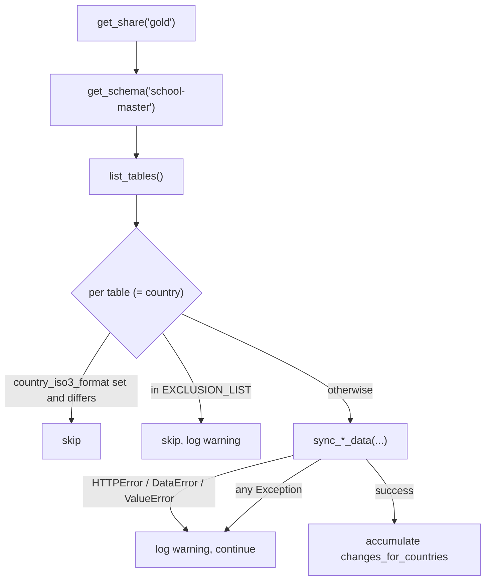

# Databricks Delta Sharing

Three of the four data sources arrive through [Delta Sharing](https://delta.io/sharing/), Databricks'
open protocol for cross-organisation table sharing. Giga's data platform publishes the shares; this
backend consumes them.

**Client**: `delta-sharing` 1.0.5 — declared in **`[dev-packages]`** in [Pipfile](../../Pipfile)
despite being imported by production ingestion code. The Docker build installs dev packages, so it
works; a `pipenv install --deploy` without `--dev` would break ingestion.

---

## The three shares

All configured under `DATA_SOURCE_CONFIG`
([config/settings/base.py:426](../../config/settings/base.py#L426)).

| | School Master | Health Master | QoS |
|---|---|---|---|
| Share | `SCHOOL_MASTER_SHARE_NAME` (`gold`) | `HEALTH_MASTER_SHARE_NAME` (`gold`) | `QOS_SHARE_NAME` (`gold`) |
| Schema | `school-master` | `health-master` | `qos` |
| Entity schema | — | — | `QOS_ENTITY_SCHEMA_NAME` (`health-master`) |
| Endpoint | `SCHOOL_MASTER_ENDPOINT` | `HEALTH_MASTER_ENDPOINT` | `QOS_ENDPOINT` |
| Token | `SCHOOL_MASTER_BEARER_TOKEN` | `HEALTH_MASTER_BEARER_TOKEN` | `QOS_BEARER_TOKEN` |
| Expiry | `SCHOOL_MASTER_EXPIRATION_TIME` | `HEALTH_MASTER_EXPIRATION_TIME` | `QOS_EXPIRATION_TIME` |
| Creds version | `…_SHARE_CREDENTIALS_VERSION` (1) | same | same |
| Exclusion list | ✓ | ✓ | ✓ |
| **Inclusion list** | — | ✓ | — |
| Review grace | 48 h | 48 h | — |
| Lands in | `SchoolMasterData` | `HealthEntityMasterIntermediateData` | `QoSData` |

`.env_example` has the School Master and QoS blocks. **The entire `HEALTH_MASTER_*` group is
missing**, as is `QOS_ENTITY_SCHEMA_NAME`.

Note `QOS_ENTITY_SCHEMA_NAME` defaults to `health-master` rather than a QoS-specific schema — worth
confirming against the real platform layout.

## One table per country

Each schema exposes one table named by ISO3 code. Ingestion iterates
`client.list_tables(schema)`:



## The profile file

`delta-sharing` requires credentials as a JSON file on disk, so the task writes one
([proco/data_sources/tasks.py:122](../../proco/data_sources/tasks.py#L122)):

```python
profile_json = {
    'shareCredentialsVersion': ds_settings.get('SHARE_CREDENTIALS_VERSION', 1),
    'endpoint': ds_settings.get('ENDPOINT'),
    'bearerToken': ds_settings.get('BEARER_TOKEN'),
    'expirationTime': ds_settings.get('EXPIRATION_TIME'),
}
profile_file = os.path.join(settings.BASE_DIR, 'school_master_profile_{dt}.share'.format(...))
open(profile_file, 'w').write(json.dumps(profile_json))
```

and removes it at the end:

```python
try:
    os.remove(profile_file)
except OSError:
    pass
```

> **A worker killed between those two points leaves a file containing a live bearer token in the
> application root.** The filename is timestamped, so repeated crashes accumulate files. Add this
> to any post-crash checklist:
>
> ```bash
> ls -la /code/*_profile_*.share 2>/dev/null && rm -f /code/*_profile_*.share
> ```
>
> A `tempfile.NamedTemporaryFile` with `delete=True`, or a `try/finally`, would remove the window.

## Failure handling

Share-level failures are caught and the whole pull is skipped:

```python
except HTTPError as ex:
    logger.warning('Failed to get School Master share [HTTP {0}]: {1}'.format(
        getattr(ex.response, 'status_code', 'error'), ex))
    school_master_share = None
except Exception as ex:
    logger.warning('Failed to get School Master share: {0}'.format(ex))
    school_master_share = None
```

Table-level failures are caught per country and the loop continues:

```python
except (HTTPError, DataError, ValueError) as ex:
    logger.warning('Exception caught for "{0}": {1}'.format(schema_table.name, str(ex)))
except Exception as ex:
    logger.warning('Exception caught for "{0}": {1}'.format(schema_table.name, str(ex)))
```

Both branches are identical — the first is redundant.

> **Everything is a `warning` and the task still reports success.** There is no metric, no alert and
> no Sentry event. A country can stop updating indefinitely while the job looks healthy. Grepping
> worker logs is the only detection mechanism:
>
> ```bash
> grep -E 'Failed to get .* share|Exception caught for' /code/logs/celeryd-*.log
> ```

Note also that the `errors` list built at the top of `load_data_from_school_master_apis` is **never
appended to**, so the error-summary section of the change-notification email is always empty even
though the formatting code exists.

## Token expiry

`EXPIRATION_TIME` is passed straight into the profile. When a token expires, every table fails and
the share-level `get_share` typically fails first — producing `Failed to get School Master share`
in the logs and no data for any country.

There is **no proactive expiry check and no alert**. Track token expiry dates outside the
application.

## Change notification

When anything changed, or schools were deleted:

1. Email to everyone holding `CAN_UPDATE_SCHOOL_MASTER_DATA` or `CAN_PUBLISH_SCHOOL_MASTER_DATA`,
   including a deep link to `SCHOOL_MASTER_DASHBOARD_URL` and a deleted-school summary (full list up
   to 5, a count beyond that).
2. `send_school_master_data_change_slack_notification.delay(country_iso3_format)` per affected
   country.

## Schedules

| Task | Schedule (UTC) | Share |
|---|---|---|
| `update_static_data` | `*/4h :47` | school-master |
| `update_entity_static_data` | `*/4h :52` | health-master |
| `update_qos_data` | `04:00` | qos |
| `update_entity_qos_data` | `05:00` | health-master (entity QoS) |
| `load_data_from_qos_apis` | chained from `update_live_data` | qos |

## Manual invocation

```bash
# All countries
curl "https://<host>/api/sources/load/school_master/"
curl "https://<host>/api/sources/load/qos/"

# One country
pipenv run python manage.py shell -c "
from proco.data_sources.tasks import update_static_data
update_static_data.delay(country_iso3_format='BRA')"

# Entity QoS, date-bounded
pipenv run python manage.py entity_qos_sync \
  -entity_type='health' -start_date='2026-09-01' -end_date='2026-09-15'
```

## Recovery

```bash
pipenv run python manage.py data_loss_recovery_for_school_master_version \
  -country_code='BRA' --check_latest_version

pipenv run python manage.py data_loss_recovery_for_school_master_version \
  -country_code='BRA' -pull_version=42 --pull_data --schedule
```

More in [../08-operations/runbooks.md](../08-operations/runbooks.md).

## Related

- [../05-background-jobs/ingestion-master-data.md](../05-background-jobs/ingestion-master-data.md)
- [../05-background-jobs/ingestion-live-data.md](../05-background-jobs/ingestion-live-data.md)
- [../04-admin-flows/school-master-review-publish.md](../04-admin-flows/school-master-review-publish.md)
