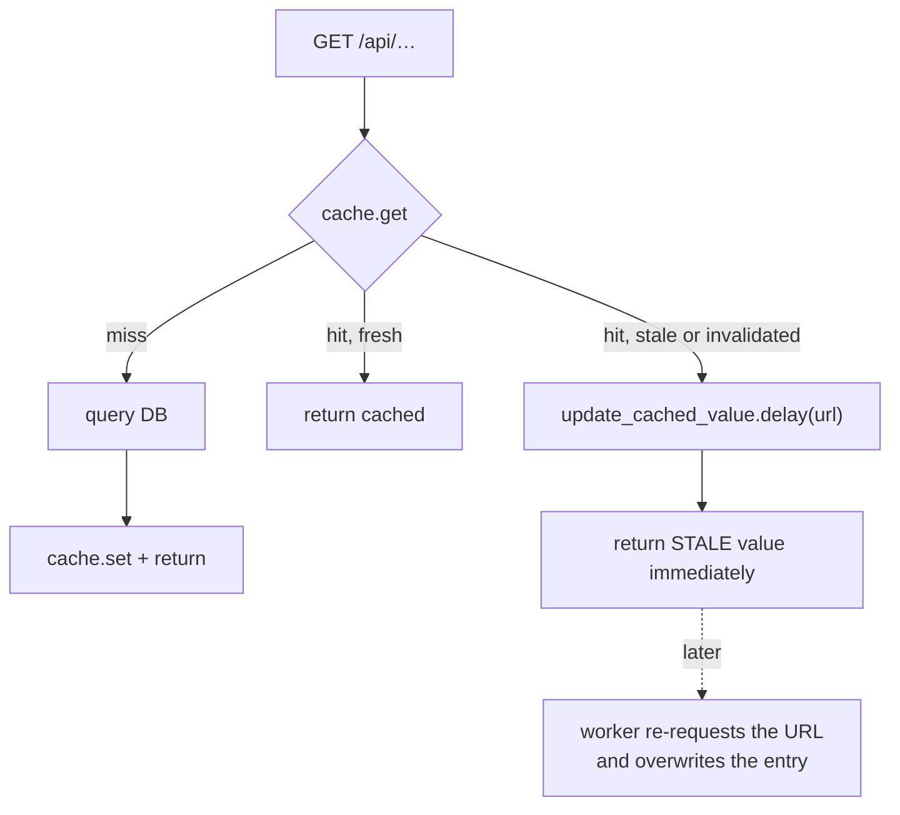

# Caching and performance

Three mechanisms carry most of the load: a stale-while-revalidate Redis cache, a read replica
selected per request, and a nightly warmer that pre-computes the hot paths.

---

## The soft cache

[proco/utils/cache.py:11](../../proco/utils/cache.py#L11). A layer over `django_redis` that trades
strict freshness for never making a user wait on a rebuild.

### How an entry is stored

```python
cache.set('{PREFIX}_{key}', {
    'value': value,
    'invalidated': False,
    'request_path': request_path,
    'expired_at': timezone.now().timestamp() + soft_timeout,
}, None)
```

The final `None` is the **Redis TTL** — entries never expire on their own. Expiry is a *field
inside the value*, not a property of the key. Nothing is evicted except by explicit invalidation or
Redis `maxmemory` policy.

### How an entry is read

```python
def get(self, key):
    value = cache.get('{PREFIX}_{key}', None)
    if value:
        if ((value['expired_at'] and value['expired_at'] < timezone.now().timestamp())
            or value.get('invalidated', True)) and value.get('request_path', None):
            update_cached_value.delay(url=value['request_path'])
        return value['value']
```

Read that carefully:

1. A stale or invalidated entry is **still returned**, after queuing a refresh.
2. The refresh only happens if `request_path` was stored. An entry set without one goes stale
   permanently and is never refreshed.
3. `value.get('invalidated', True)` defaults to **`True`** — an entry written by older code without
   the `invalidated` key is treated as invalidated on every read, queuing a refresh task every
   time. After a deploy that changes the cache value shape, expect a burst of refresh tasks.



### Invalidation

```python
cache_manager.invalidate(key='*', hard=False)
```

| Mode | Behaviour |
|---|---|
| Soft (default) | `cache.keys(pattern)` then set `invalidated=True` on each. Users keep getting stale data until a refresh lands. |
| Hard (`hard=True`) | `cache.delete(key)` per key. The next request is a full miss and blocks. |

Which one the nightly warmer uses depends on `INVALIDATE_CACHE_HARD` — a **string**, compared as
`settings.INVALIDATE_CACHE_HARD.lower() == 'true'`
([proco/utils/tasks.py:52](../../proco/utils/tasks.py#L52)). Setting it to a Python boolean will
raise `AttributeError` on `.lower()`. Keep it a string.

> **`cache.keys('SOFT_CACHE_*')` is a `KEYS` scan over the whole keyspace.** On a large Redis this
> blocks the server for the duration. It runs nightly at 04:45 and on every manual cache
> invalidation from the admin console. If Redis latency spikes at 04:45, this is why.

### Two partitions

| Manager | Prefix | Use |
|---|---|---|
| `cache_manager` | `SOFT_CACHE` | Normal cached responses |
| `no_expiry_cache_manager` | `NO_EXPIRY_CACHE_PREFIX` (default `NO_EXPIRY_CACHE`) | Values that should never be refreshed |

### HTTP cache headers

`custom_cache_control(**kwargs)` ([proco/utils/cache.py:67](../../proco/utils/cache.py#L67)) is a
view decorator that applies `Cache-Control` only for listed status codes and sends
`no-cache` headers otherwise:

```python
@method_decorator([custom_cache_control(
    public=True,
    max_age=settings.CACHE_CONTROL_MAX_AGE_FOR_FE,
    cache_status_codes=[200],
)], name='dispatch')
```

Without `cache_status_codes`, headers are applied unconditionally — including to error responses,
which would then be cached by browsers and CDNs. Always pass it.

---

## The read replica

### How a request is routed

Two pieces working together:

**`CustomRequestDBRouterMiddleware`** ([proco/utils/db_routers.py:36](../../proco/utils/db_routers.py#L36))
resolves the URL name in `process_view` and sets a thread-local when it matches the whitelist:

```python
if request.method == 'GET':
    url_name = resolve(request.path_info).url_name
    if url_name in settings.READ_ONLY_DATABASE_ALLOWED_REQUESTS:
        THREAD_LOCAL.OVERRIDE_DB_FOR_READ = settings.READ_ONLY_DB_KEY
```

**`ReadOnlyDBRouter`** reads that thread-local in `db_for_read`.

`process_response` clears it. Note that **`process_exception` does not exist** — if a view raises,
`process_response` still runs under Django's middleware contract, so the flag is cleared. But the
thread-local pattern remains fragile: any code that spawns a thread or defers work inside the
request will not inherit it, and any code path that bypasses `process_response` leaks the flag onto
the next request served by that worker thread.

### The whitelist

[config/settings/base.py:545](../../config/settings/base.py#L545). **11 active, 4 commented out:**

| Active | |
|---|---|
| `global-stat` | `get-time-player-data` |
| `get-latest-week-and-month` | `list-published-advance-filters` |
| `list-published-data-layers` | `info-data-layer` |
| `download-schools` | `download-countries` |
| `search-countries-admin-schools` | `search-countries-admin-entities` |
| `tiles-view` | |

| Commented out | Consequence |
|---|---|
| `tiles-connectivity-view` | None — connects to the replica directly |
| `tiles-school-connectivity-status-view` | None — same |
| `map-data-layer` | **Runs on the primary** |
| `get-time-player-data-v2` | **Runs on the primary** |

> `map-data-layer` (`/api/accounts/layers/{id}/map/`) and the v2 time player are both map-facing
> read endpoints running against the write database. If either is on a hot path, moving it to the
> whitelist is a one-line change with a measurable effect. Check why they were removed first —
> most likely replica lag made freshly published layers appear missing.

### Tiles bypass the router

Tile SQL uses `connections[settings.READ_ONLY_DB_KEY]` directly. The consequence is covered in
[../03-user-flows/map-exploration.md](../03-user-flows/map-exploration.md): tiles fail when the
replica is down, returning `204` — an empty map rather than an error.

### `statement_timeout`

Set through the connection URL, not settings:

```
READ_ONLY_DATABASE_URL=postgis://…/proco?options=-c statement_timeout=300000
```

Local compose uses 300 s; the commented-out Celery services use 1 800 s. Getting this right is the
main protection against one expensive map query occupying a replica connection indefinitely.

---

## Cache warming

`update_all_entity_cached_values` at **04:45 UTC**
([proco/utils/tasks.py:859](../../proco/utils/tasks.py#L859); the school-side
`update_all_cached_values` at [line 34](../../proco/utils/tasks.py#L34) is the disabled
predecessor and is the clearer read).

Sequence:

1. Optionally invalidate everything (`clean_cache=True`, which is what the schedule passes).
2. Warm three global endpoints: `search-countries-admin-schools`, `countries-list`, `global-stat`.
3. Select countries having **at least one school**.
4. Resolve each country's default live connectivity layer.
5. Per country, queue four to five `update_cached_value` tasks.

Each warm task re-requests the URL through DRF's `APIClient`, so the response is produced by the
real view and stored under the real cache key.

### What is warmed, exactly

```python
update_cached_value.s(url=reverse('locations:countries-detail', kwargs={'pk': country.code.lower()}))
update_cached_value.s(url=reverse('connection_statistics:global-stat'),
                      query_params={'country_id': country.id})
update_cached_value.s(url=reverse('accounts:list-published-advance-filters',
                                  kwargs={'status': 'PUBLISHED', 'country_id': country.id}),
                      query_params={'expand': 'column_configuration', 'ordering': 'name'})
```

> **The cache key includes the query parameters.** A client requesting the same endpoint with a
> different `expand`, different `ordering`, or an extra parameter gets a **cold** cache. The
> frontend is written to match these exactly — if you change a query string on the frontend, change
> the warmer to match or you will silently lose the warm path.

### Layer warming is selective

```python
Q(is_default=True) | Q(is_default=False,
                       data_layer__category=LAYER_CATEGORY_CONNECTIVITY,
                       data_layer__created_by__isnull=True)
```

Only the country default plus **system-created** connectivity layers are warmed. An admin-created
layer is not warmed unless it is the country default — it will be consistently slower, with nothing
in the UI to indicate why.

`LIVE_LAYER_CACHE_FOR_COUNTRY_IDS` (default **`['144']`** — a single country) and `LIVE_LAYER_CACHE_FOR_WEEKS` (default **5**) bound this work.

> Both defaults are narrow. `LIVE_LAYER_CACHE_FOR_COUNTRY_IDS` defaults to country id `144` only,
> not to "all countries" — so on an unconfigured environment live-layer warming covers **one
> country**. Neither variable is in `.env_example`'s live-layer section with a meaningful value
> (`LIVE_LAYER_CACHE_FOR_COUNTRY_IDS=` is present but empty, which `env.list` reads as `['']`).

---

## Known performance issues

Ordered by expected impact.

### 1. `user.permissions` is recomputed on every access

[proco/custom_auth/models.py:60](../../proco/custom_auth/models.py#L60). A property, no caching,
two queries per call (`user.roles.all()`, then `role.permissions`). Permission classes are stacked
three or four deep and each calls it; serializers call it again.

Caching it on the request or memoising per instance is low-risk and affects **every authenticated
request**. See [../04-admin-flows/auth-and-rbac.md](../04-admin-flows/auth-and-rbac.md).

### 2. Admin-boundary lookups in the publish job

[proco/data_sources/tasks.py:347](../../proco/data_sources/tasks.py#L347) does two
`CountryAdminMetadata.objects.filter(...).first()` calls **per row**, inside a loop over chunks of
100. For a country-wide publish this is the dominant cost. Pre-loading a
`{(country, giga_id_admin, layer): id}` map once would remove both queries.

### 3. `cache.keys()` on invalidation

A blocking `KEYS` scan, nightly and on demand. `SCAN` with a cursor is the standard replacement.

### 4. Unbounded sampling limits

`COUNTRY_MAP_API_SAMPLING_LIMIT` and `ADMIN_MAP_API_SAMPLING_LIMIT` default to `None`.
`.env_example` suggests 15 000 / 20 000. Confirm they are set in every environment.

### 5. Two hot endpoints not on the replica

`map-data-layer` and `get-time-player-data-v2`, as above.

### 6. Tile truncation is invisible

`LIMIT 50000` (90 000 at `z=0`, 30 000 at `z=1`) silently drops rows. There is no header or field
indicating truncation, so "missing schools" reports are hard to distinguish from data problems.

---

## Diagnosing a slow endpoint

1. **Is it cached?** Request it with `?cache=off` and compare. A large gap means the cache is
   working and the problem is a cold key.
2. **Is the cache key what the warmer produces?** Compare your query string against the `reverse()`
   + `query_params` in [proco/utils/tasks.py](../../proco/utils/tasks.py). A mismatched `expand` or
   `ordering` is the usual culprit.
3. **Is it on the replica?** Check the URL name against `READ_ONLY_DATABASE_ALLOWED_REQUESTS`. The
   middleware logs `Using Read-Only DB for request:` or `CHECK:: Using Write DB for GET request:`
   at INFO on every GET — grep for those lines.
4. **Is it the permission N+1?** Compare an authenticated request against an anonymous one on an
   endpoint that allows both.
5. **Is the replica lagging?** Tiles and whitelisted endpoints will be slow together while
   everything else is fine.

## Related

- [../05-background-jobs/cache-warming.md](../05-background-jobs/cache-warming.md)
- [../04-admin-flows/cache-invalidation.md](../04-admin-flows/cache-invalidation.md)
- [../02-domain-model/databases-and-routing.md](../02-domain-model/databases-and-routing.md)
