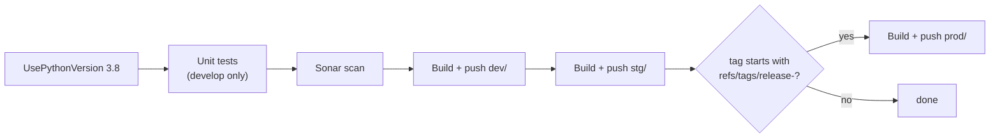

# Deployment

## Pipeline

[azure-pipeline-dev.yml](../../azure-pipeline-dev.yml), Azure Pipelines on `ubuntu-22.04`,
Python 3.8.

### Triggers

| Trigger | Result |
|---|---|
| Push to `develop` | Build + push `dev/$(app)` |
| Push to `staging` | Build + push `stg/$(app)` |
| Tag `release-*` | Build + push `prod/$(app)` |

Build name: `$(SourceBranchName).$(Build.BuildId).$(Date:yyyyMMdd).$(Rev:r)`.

### Steps



> **Three things about this pipeline are worth knowing before you rely on it.**
>
> 1. **Tests run only on `develop`** (`condition: eq(variables['Build.SourceBranch'],
>    'refs/heads/develop')`) **and are marked `continueOnError: true`.** A failing test suite does
>    not fail the build, and pushes to `staging` do not run tests at all.
> 2. **The staging image build has its condition commented out.** The `Stg - Build and Push image`
>    step runs on **every** build, including from `develop`. Only the production step is properly
>    gated on a `release-*` tag.
> 3. **The Sonar scan's condition is also commented out**, so it runs on every build. That is
>    harmless, but it means the scan result is not branch-specific.

### Test step

```bash
sudo systemctl start postgresql.service
sudo -u postgres psql -c "ALTER USER postgres WITH PASSWORD 'root';"
sudo apt install postgis postgresql-14-postgis-3
sudo apt-get install redis
sudo apt install binutils libproj-dev gdal-bin
sudo pip install pipenv
pipenv install --ignore-pipfile --dev
./scripts/runtests.sh
```

Note `--dev` — required, because `delta-sharing` and `django-anymail` live in `[dev-packages]`.

### Sonar

Excludes migrations, `proco_data_migrations`, tests, `admin.py`, management commands, and three
legacy packages (`dailycheckapp_contact`, `realtime_dailycheckapp`, `realtime_unicef`) that no
longer exist in the tree. Coverage comes from `coverage.xml`, produced by `runtests.sh`.

## Container images

Single [Dockerfile](../../Dockerfile) at the root; the same image runs web, worker and beat,
differentiated by entrypoint.

| Entrypoint | Role |
|---|---|
| [web-worker.sh](../../web-worker.sh) | Web: migrate → collectstatic → gunicorn |
| [celery.sh](../../celery.sh) | Worker (+ Flower when enabled) |
| [celery-dev.sh](../../celery-dev.sh) | Worker, development |
| [celerybeat.sh](../../celerybeat.sh) | Beat with RedBeat |

Variants under [docker/](../../docker/): `Dockerfile-dev`, `Dockerfile-local`, `Dockerfile-db`,
`Dockerfile-db-local`, `Dockerfile-db15`.

## What a web deploy does

```bash
service ssh start
pipenv run python manage.py migrate
pipenv run python manage.py collectstatic --noinput
pipenv run python -m config.prometheus_multiproc -- \
    gunicorn config.wsgi:application -c /code/config/gunicorn.py -b 0.0.0.0:8000 -w 8 --timeout=300
```

| Aspect | Value |
|---|---|
| Workers | 8 |
| Timeout | 300 s |
| Bind | `0.0.0.0:8000` |
| Metrics | Wrapped in `prometheus_multiproc` for multi-worker metric aggregation |

> **`migrate` runs on every web container start.** With multiple replicas starting simultaneously
> this is a race — one wins, the others see a partially applied state or an advisory-lock wait.
> The PostGIS `tuple concurrently updated` patch
> ([proco/utils/db_routers.py:17](../../proco/utils/db_routers.py#L17)) exists precisely because of
> this pattern. A dedicated migration job would be safer.
>
> **`migrate` targets `default` only.** The `gigameter_database` schema is migrated separately —
> `GigaMeterDBRouter.allow_migrate` will refuse to apply `giga_meter` migrations to `default`, so
> they simply do not run.

An SSH daemon is started in every container ([sshd_config](../../sshd_config)) — the standard Azure
App Service pattern for shell access. Environment variables are exported to `/etc/profile` so an SSH
session inherits them:

```bash
for var in $(compgen -e); do echo "export $var=${!var}" >> /etc/profile; done
```

> That loop writes **every** environment variable, including database URLs, bearer tokens and API
> keys, to a world-readable file inside the container. Anyone with SSH access has full credential
> access. That is inherent to the pattern; the mitigation is restricting who can reach the SSH
> endpoint.

## Workers and beat

Worker ([celery.sh](../../celery.sh)):

```bash
pipenv run celery --app=proco.taskapp worker \
    --concurrency=3 --time-limit=300 --soft-time-limit=60 \
    --logfile="$LOG_DIR/celeryd-%n.log" --loglevel=INFO
```

Those CLI limits are overridden per task — see
[../05-background-jobs/README.md](../05-background-jobs/README.md#time-limits).

Beat:

```bash
pipenv run celery --app=proco.taskapp beat --scheduler=redbeat.RedBeatScheduler
```

> **Exactly one beat instance must run.** RedBeat's lock (`redbeat_lock_timeout = 36000`) provides
> leader election, but a 10-hour lock means a crashed beat can leave the lock held for a long time.
> Run beat as a singleton and restart it deliberately.

A Flask sidecar ([hello.py](../../hello.py)) runs on port 8000 in worker and beat containers as a
health surface.

## Environment promotion

| Environment | Branch / tag | Image repo | Settings |
|---|---|---|---|
| Dev | `develop` | `dev/$(app)` | `config.settings.dev` |
| Staging | `staging` | `stg/$(app)` | `config.settings.dev` or a staging overlay |
| Production | `release-*` tag | `prod/$(app)` | `config.settings.prod` |

## Deployment checklist

**Before**

- [ ] Migrations reviewed — `manage.py makemigrations --dry-run --check` passes (CI runs this)
- [ ] New environment variables added to **every** environment. Check the gap list in
      [../01-getting-started/environment-variables.md](../01-getting-started/environment-variables.md#variables-missing-from-envexample)
- [ ] Beat schedule changes: plan to delete stale `gigamaps:*` Redis keys for removed entries
- [ ] Giga Meter migrations planned separately if `proco/giga_meter/` changed
- [ ] `ENABLED_*_EMAILS` off in non-production environments sharing a mail provider

**After**

- [ ] `/health/` returns `OK`
- [ ] `/metrics` responds if `ENABLED_BACKEND_PROMETHEUS_METRICS`
- [ ] Beat restarted and the schedule reloaded
- [ ] A cache warm triggered if the deploy invalidated caches —
      [runbooks.md](runbooks.md#8-everything-is-slow-after-a-deploy)
- [ ] No leftover `*_profile_*.share` files if workers restarted mid-ingestion
- [ ] `BackgroundTask` has no `running` rows orphaned by the restart

## Rollback

Redeploy the previous image tag. **Migrations do not roll back automatically** — a deploy that added
a migration needs a manual `migrate <app> <previous_migration>` before the older image will start
cleanly.

## Related

- [monitoring.md](monitoring.md)
- [runbooks.md](runbooks.md)
- [../01-getting-started/local-setup.md](../01-getting-started/local-setup.md)
